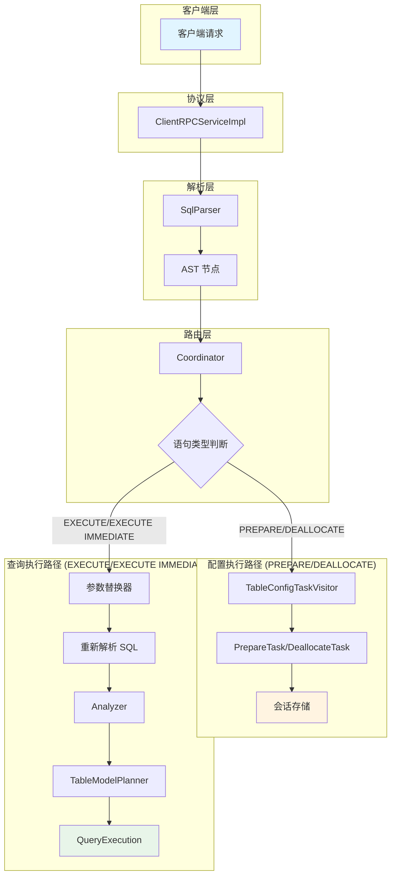
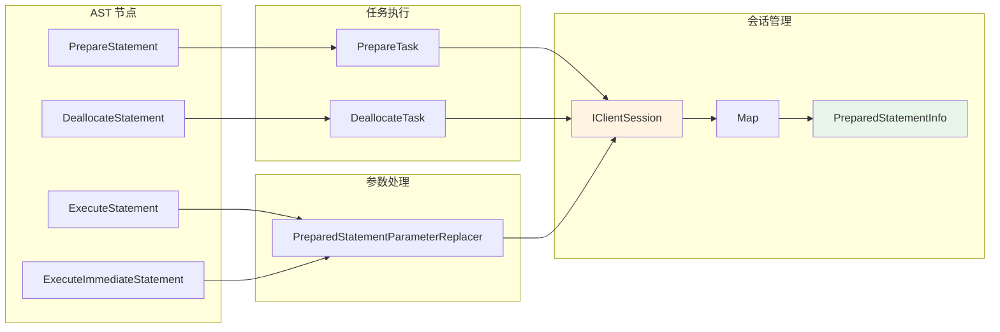
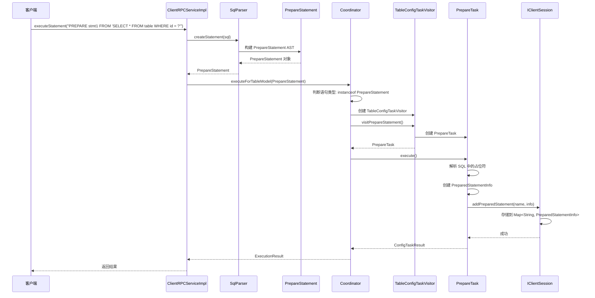
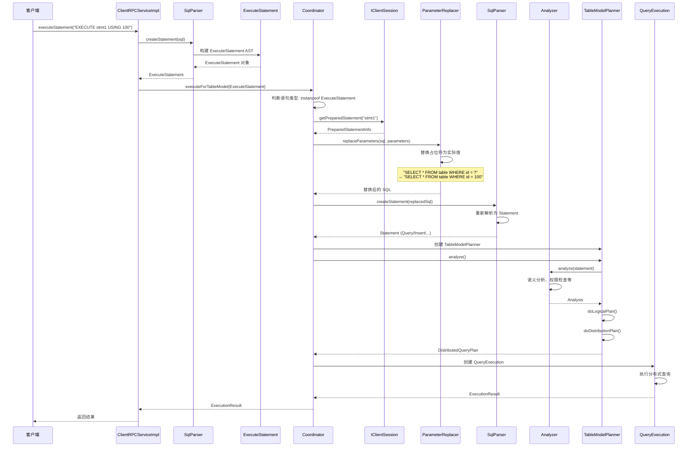
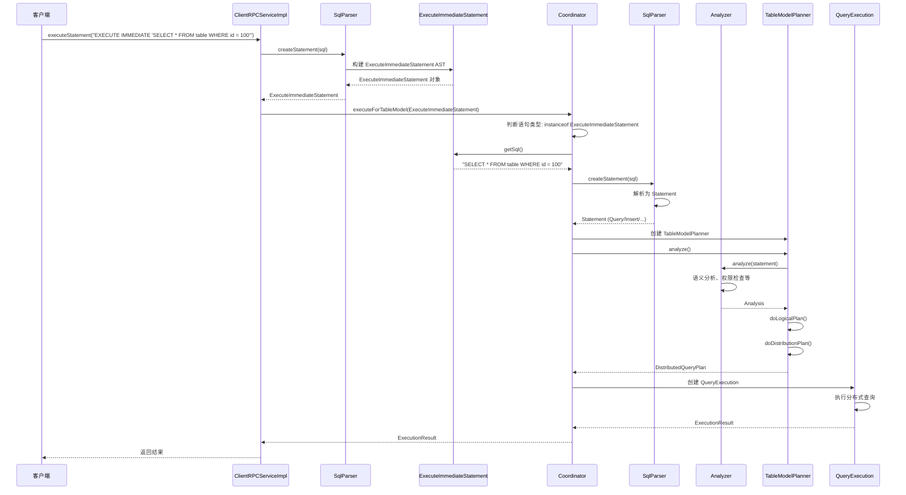
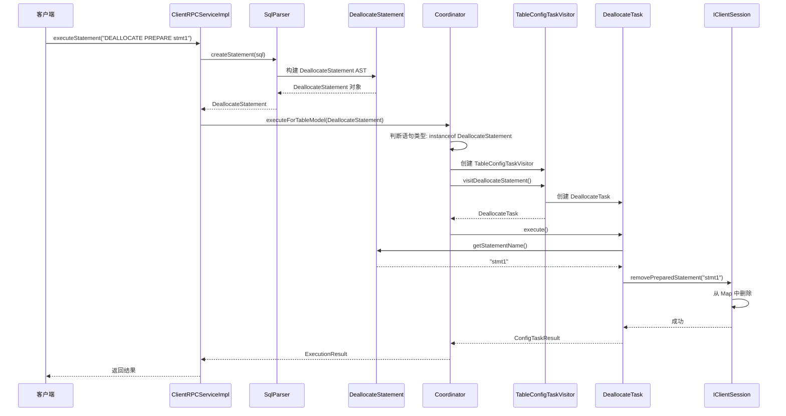
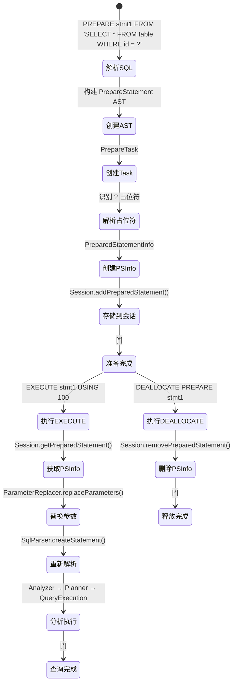
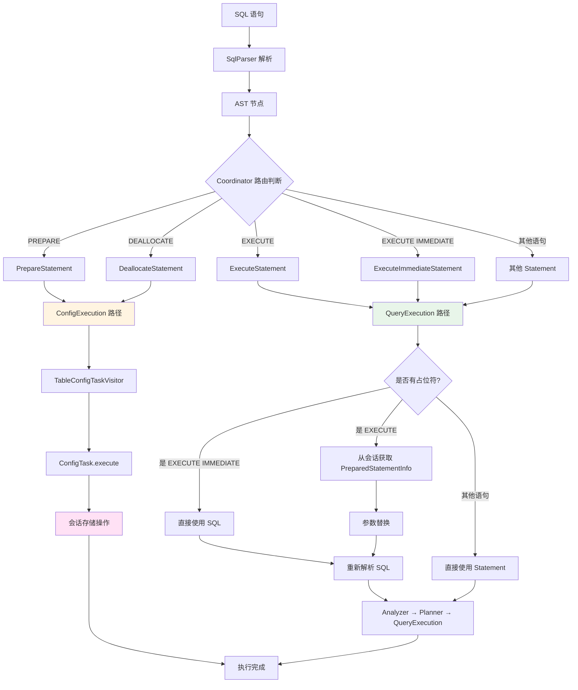

# IoTDB PrepareStatement 实现设计文档

## 1. 整体架构图

### 1.1 系统架构概览



### 1.2 组件交互图



## 2. 详细流程图

### 2.1 PREPARE 语句执行流程



### 2.2 EXECUTE 语句执行流程



### 2.3 EXECUTE IMMEDIATE 语句执行流程



### 2.4 DEALLOCATE 语句执行流程



## 3. 数据流图

### 3.1 Prepared Statement 生命周期



### 3.2 语句路由决策树



## 4. 整体设计流程

### 1.1 语句分类

根据用户需求，四种语句的处理方式如下：

1. **PREPARE** - 类似 DDL，直接转化为 Task，不走分布式查询规划
2. **DEALLOCATE** - 类似 DDL，直接转化为 Task，不走分布式查询规划  
3. **EXECUTE** - 在 Analyzer 之前转化为真正需要执行的 SQL，走完整的分布式查询规划
4. **EXECUTE IMMEDIATE** - 在 Analyzer 之前转化为真正需要执行的 SQL，走完整的分布式查询规划

### 1.2 Server 端执行流程

```
客户端请求
    ↓
ClientRPCServiceImpl.executeStatement()
    ↓
SqlParser.createStatement() -> 解析为 AST
    ↓
Coordinator.executeForTableModel()
    ↓
判断语句类型:
    ├─ PREPARE/DEALLOCATE → ConfigExecution
    │   └─ TableConfigTaskVisitor.visitXXX()
    │       └─ PrepareTask/DeallocateTask.execute()
    │           └─ 在会话中存储/删除 prepared statement
    │
    └─ EXECUTE/EXECUTE IMMEDIATE → QueryExecution
        └─ 参数替换: 将占位符替换为实际值
        └─ 重新解析: SqlParser.createStatement(替换后的SQL)
        └─ TableModelPlanner.analyze()
            └─ Analyzer.analyze() -> 走完整的分布式查询规划
```

## 2. 需要修改的文件清单

### 2.1 SQL 语法解析层

#### 2.1.1 语法文件
- **文件**: `iotdb-core/relational-grammar/src/main/antlr4/org/apache/iotdb/db/relational/grammar/sql/RelationalSql.g4`
- **修改内容**: 
  - 在 `statement` 规则中添加 prepare 相关语句
  - 添加 `prepareStatement`、`executeStatement`、`executeImmediateStatement`、`deallocateStatement` 规则
  - 定义参数占位符语法（如 `?` 或 `$1`, `$2`）

#### 2.1.2 AST 节点类
- **文件**: `iotdb-core/datanode/src/main/java/org/apache/iotdb/db/queryengine/plan/relational/sql/ast/PrepareStatement.java` (新建)
- **文件**: `iotdb-core/datanode/src/main/java/org/apache/iotdb/db/queryengine/plan/relational/sql/ast/ExecuteStatement.java` (新建)
- **文件**: `iotdb-core/datanode/src/main/java/org/apache/iotdb/db/queryengine/plan/relational/sql/ast/ExecuteImmediateStatement.java` (新建)
- **文件**: `iotdb-core/datanode/src/main/java/org/apache/iotdb/db/queryengine/plan/relational/sql/ast/DeallocateStatement.java` (新建)

#### 2.1.3 AST Builder
- **文件**: `iotdb-core/datanode/src/main/java/org/apache/iotdb/db/queryengine/plan/relational/sql/parser/AstBuilder.java`
- **修改内容**: 
  - 添加 `visitPrepareStatement()`、`visitExecuteStatement()`、`visitExecuteImmediateStatement()`、`visitDeallocateStatement()` 方法

### 2.2 会话管理层

#### 2.2.1 会话接口
- **文件**: `iotdb-core/datanode/src/main/java/org/apache/iotdb/db/protocol/session/IClientSession.java`
- **修改内容**: 
  - 添加 `Map<String, PreparedStatementInfo> preparedStatements` 字段
  - 添加 `addPreparedStatement(String name, PreparedStatementInfo info)` 方法
  - 添加 `removePreparedStatement(String name)` 方法
  - 添加 `getPreparedStatement(String name)` 方法

#### 2.2.2 PreparedStatementInfo 类
- **文件**: `iotdb-core/datanode/src/main/java/org/apache/iotdb/db/protocol/session/PreparedStatementInfo.java` (新建)
- **内容**: 
  ```java
  public class PreparedStatementInfo {
    private final String sql;  // 原始 SQL 语句（带占位符）
    private final List<ParameterPlaceholder> placeholders;  // 占位符列表
    private final ZoneId zoneId;  // 时区信息
    // ... 其他元数据
  }
  ```

#### 2.2.3 会话实现类
- **文件**: `iotdb-core/datanode/src/main/java/org/apache/iotdb/db/protocol/session/ClientSession.java`
- **文件**: `iotdb-core/datanode/src/main/java/org/apache/iotdb/db/protocol/session/InternalClientSession.java`
- **修改内容**: 实现新的接口方法

### 2.3 执行路由层

#### 2.3.1 Coordinator
- **文件**: `iotdb-core/datanode/src/main/java/org/apache/iotdb/db/queryengine/plan/Coordinator.java`
- **修改内容**: 
  - 在 `createQueryExecutionForTableModel()` 方法中，添加对 `PrepareStatement` 和 `DeallocateStatement` 的判断，使其走 `ConfigExecution` 路径
  - 对 `ExecuteStatement` 和 `ExecuteImmediateStatement`，在执行前进行参数替换和重新解析

### 2.4 Task 执行层

#### 2.4.1 TableConfigTaskVisitor
- **文件**: `iotdb-core/datanode/src/main/java/org/apache/iotdb/db/queryengine/plan/execution/config/TableConfigTaskVisitor.java`
- **修改内容**: 
  - 添加 `visitPrepareStatement()` 方法
  - 添加 `visitDeallocateStatement()` 方法

#### 2.4.2 PrepareTask
- **文件**: `iotdb-core/datanode/src/main/java/org/apache/iotdb/db/queryengine/plan/execution/config/session/PrepareTask.java` (新建)
- **内容**: 执行 PREPARE 语句，将 prepared statement 存储到会话中

#### 2.4.3 DeallocateTask
- **文件**: `iotdb-core/datanode/src/main/java/org/apache/iotdb/db/queryengine/plan/execution/config/session/DeallocateTask.java` (新建)
- **内容**: 执行 DEALLOCATE 语句，从会话中删除 prepared statement

### 2.5 EXECUTE 处理层

#### 2.5.1 参数替换工具类
- **文件**: `iotdb-core/datanode/src/main/java/org/apache/iotdb/db/queryengine/plan/relational/sql/PreparedStatementParameterReplacer.java` (新建)
- **功能**: 
  - 将 prepared statement 中的占位符替换为实际参数值
  - 处理参数类型转换和转义

#### 2.5.2 Coordinator 中的 EXECUTE 处理
- **文件**: `iotdb-core/datanode/src/main/java/org/apache/iotdb/db/queryengine/plan/Coordinator.java`
- **修改内容**: 
  - 在 `createQueryExecutionForTableModel()` 中，对 `ExecuteStatement` 和 `ExecuteImmediateStatement` 进行特殊处理：
    1. 从会话中获取 prepared statement（EXECUTE）或直接使用 SQL（EXECUTE IMMEDIATE）
    2. 使用 `PreparedStatementParameterReplacer` 替换参数
    3. 使用 `SqlParser.createStatement()` 重新解析替换后的 SQL
    4. 用新的 Statement 创建 `QueryExecution`

## 3. 详细实现要点

### 3.1 SQL 语法示例

```sql
-- PREPARE: 准备语句
PREPARE stmt1 FROM 'SELECT * FROM table1 WHERE id = ?';

-- EXECUTE: 执行准备好的语句
EXECUTE stmt1 USING 100;

-- EXECUTE IMMEDIATE: 立即执行 SQL
EXECUTE IMMEDIATE 'SELECT * FROM table1 WHERE id = 100';

-- DEALLOCATE: 释放准备好的语句
DEALLOCATE PREPARE stmt1;
```

### 3.2 PreparedStatementInfo 数据结构

```java
public class PreparedStatementInfo {
    private final String statementName;      // 语句名称
    private final String originalSql;        // 原始 SQL（带占位符）
    private final List<ParameterInfo> parameters;  // 参数信息
    private final ZoneId zoneId;             // 时区
    private final long createTime;          // 创建时间
    
    public static class ParameterInfo {
        private final int position;         // 参数位置（从1开始）
        private final String placeholder;   // 占位符文本（如 "?"）
        // 可以包含预期的数据类型等信息
    }
}
```

### 3.3 参数替换逻辑

```java
public class PreparedStatementParameterReplacer {
    /**
     * 将 SQL 中的占位符替换为实际参数值
     * @param sql 原始 SQL（带占位符）
     * @param parameters 参数值列表
     * @return 替换后的 SQL
     */
    public String replaceParameters(String sql, List<Object> parameters) {
        // 1. 解析占位符位置
        // 2. 将参数值转换为字符串并转义
        // 3. 替换占位符
        // 4. 返回替换后的 SQL
    }
}
```

### 3.4 执行流程细节

#### PREPARE 执行流程：
1. `TableConfigTaskVisitor.visitPrepareStatement()` 被调用
2. 创建 `PrepareTask`
3. `PrepareTask.execute()` 执行：
   - 解析 SQL 中的占位符
   - 创建 `PreparedStatementInfo` 对象
   - 调用 `clientSession.addPreparedStatement(name, info)` 存储

#### EXECUTE 执行流程：
1. `Coordinator.createQueryExecutionForTableModel()` 检测到 `ExecuteStatement`
2. 从会话中获取对应的 `PreparedStatementInfo`
3. 使用 `PreparedStatementParameterReplacer` 替换参数
4. 使用 `SqlParser.createStatement()` 重新解析替换后的 SQL
5. 递归调用 `createQueryExecutionForTableModel()` 处理新的 Statement
6. 走完整的分布式查询规划流程

#### EXECUTE IMMEDIATE 执行流程：
1. `Coordinator.createQueryExecutionForTableModel()` 检测到 `ExecuteImmediateStatement`
2. 直接使用 `ExecuteImmediateStatement.getSql()` 获取 SQL
3. 使用 `SqlParser.createStatement()` 解析 SQL
4. 递归调用 `createQueryExecutionForTableModel()` 处理新的 Statement
5. 走完整的分布式查询规划流程

#### DEALLOCATE 执行流程：
1. `TableConfigTaskVisitor.visitDeallocateStatement()` 被调用
2. 创建 `DeallocateTask`
3. `DeallocateTask.execute()` 执行：
   - 调用 `clientSession.removePreparedStatement(name)` 删除

## 4. 注意事项

1. **线程安全**: 会话中的 prepared statements 存储需要使用线程安全的数据结构（如 `ConcurrentHashMap`）
2. **参数验证**: EXECUTE 时需要验证参数数量是否匹配
3. **SQL 注入防护**: 参数替换时需要正确转义，防止 SQL 注入
4. **错误处理**: 如果 prepared statement 不存在，需要返回明确的错误信息
5. **内存管理**: 需要考虑 prepared statements 的生命周期管理，避免内存泄漏
6. **权限检查**: PREPARE 时需要检查用户是否有权限执行该 SQL 语句（可选，可以在 EXECUTE 时检查）

## 5. 测试建议

1. 单元测试：测试每个 AST 节点的创建和访问
2. 集成测试：测试完整的 PREPARE/EXECUTE/DEALLOCATE 流程
3. 参数替换测试：测试各种参数类型和边界情况
4. 并发测试：测试多线程环境下的 prepared statements 管理
5. 错误处理测试：测试各种错误场景（如 prepared statement 不存在、参数数量不匹配等）
