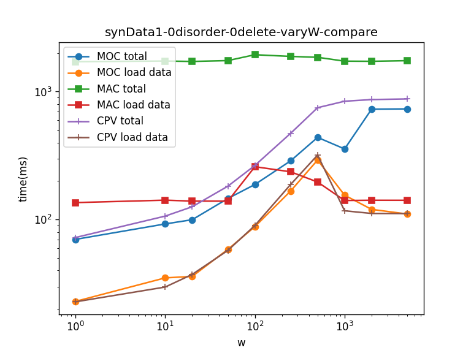
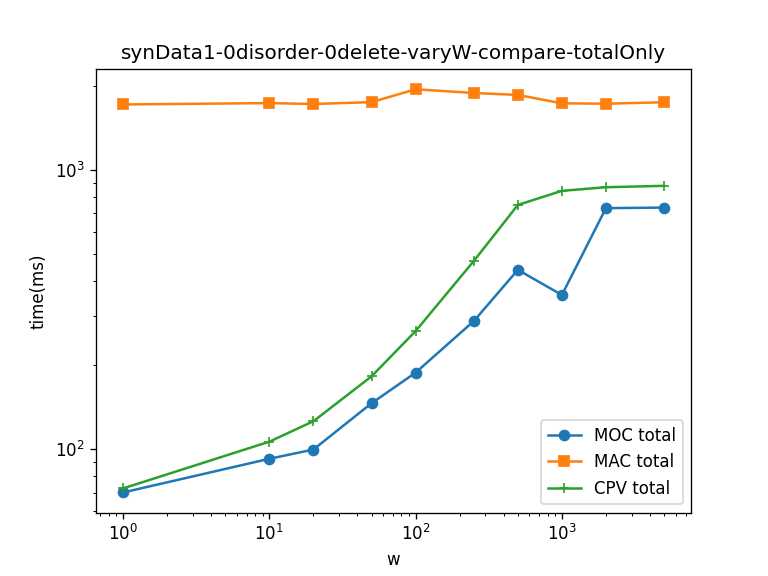
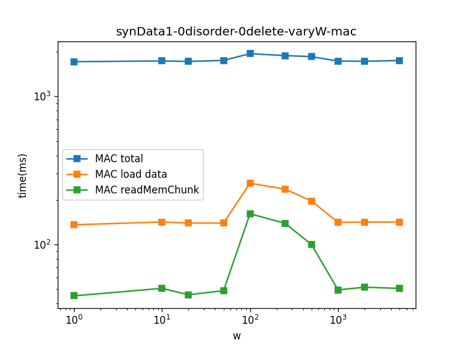
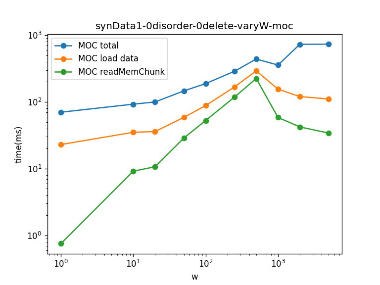
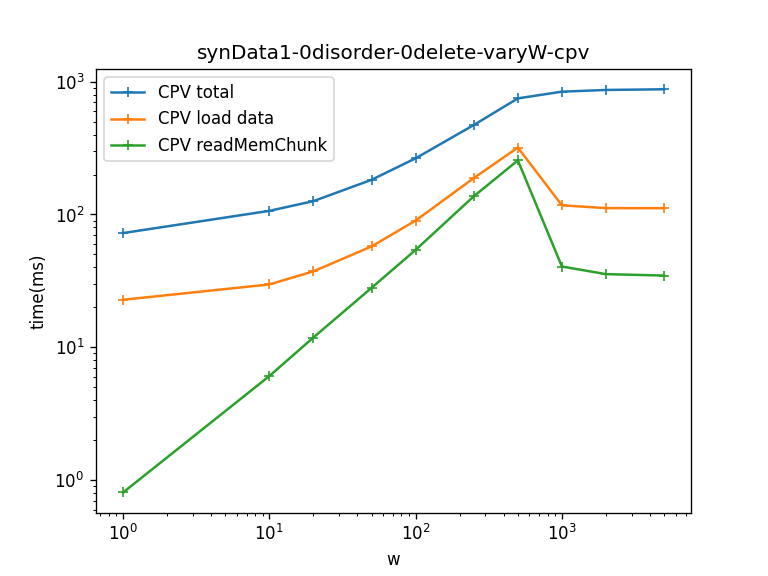

# synData1_vary_w Experiment

程序工作空间是/data3/ruilei/rl/synData1_testspace/

iotdb服务路径是/data3/ruilei/rl/iotdb-server-0.12.4/

写出来的数据存放空间是/data3/ruilei/rl/dataSpace/synData1/

## 1. Data
**1.1 服务器参数**
```
system_dir=/data3/ruilei/rl/dataSpace/synData1/system
data_dirs=/data3/ruilei/rl/dataSpace/synData1/data
wal_dir=/data3/ruilei/rl/dataSpace/synData1/wal
timestamp_precision=ms
--------------------
unseq_tsfile_size=1073741824                            # maximum size of unseq TsFile is 1024^3 Bytes
seq_tsfile_size=1073741824                              # maximum size of seq TsFile is 1024^3 Bytes
avg_series_point_number_threshold=10000                 # each chunk contains 10000 data points
compaction_strategy=NO_COMPACTION                       # compaction between levels is disabled
enable_unseq_compaction=false                           # unseq compaction is disabled
```

**1.2 写数据程序：WriteSyntheticData1.java**

时间点等间隔1ms、总时长10000s（从0到9999s的10000000个点）、值正态分布模拟、double类型的数据，使用默认压缩方法。
无乱序，无删除。每个chunk默认参数是装10000个点，所以每个chunk就是10s的数据量。
使用默认压缩方法，每个chunk大约70KB，所以一共是1000个10KB的chunks也就是总共70MB左右的一个顺序tsfile。

**1.3 写数据操作流程**

(0) 把写有三种方法的打包好的iotdb服务器上传（也就是本unify分支程序打包之后的server文件夹），路径为/data3/ruilei/rl/iotdb-server-0.12.4。

(1) 准备好服务器参数文件：
- /data3/ruilei/rl/synData1_testspace/iotdb-engine-enableCPVtrue.properties:
enable_CPV=true, 其余参数同1.1
- /data3/ruilei/rl/synData1_testspace/iotdb-engine-enableCPVfalse.properties:
  enable_CPV=false, 其余参数同1.1
  
(2) 把WriteSyntheticData1.java打成jar包。

(3) 创建write_data.sh内容为：
```
#!/bin/bash
cp iotdb-engine-enableCPVfalse.properties /data3/ruilei/rl/iotdb-server-0.12.4/conf/iotdb-engine.properties
cd /data3/ruilei/rl/iotdb-server-0.12.4/sbin
./start-server.sh &
sleep 3s
java -jar /data3/ruilei/rl/synData1_testspace/WriteSyntheticData1-0.12.4.jar
sleep 3s
./stop-server.sh
sleep 3s
echo 3 | sudo tee /proc/sys/vm/drop_caches
```

chmod +x write_data.sh

(4) 运行write_data.sh，脚本会自动替换服务器的参数文件达到设置参数的效果，然后执行jar包完成写数据。

写出来的数据文件：
```
ruilei@fit07:~/rl/dataSpace/synData1/data/sequence/root.vehicle/0/0$ ls -lh
total 70M
-rw-rw-r-- 1 ruilei ruilei 70M Feb  2 12:41 1643805456842-1-0-0.tsfile
-rw-rw-r-- 1 ruilei ruilei  61 Feb  2 12:41 1643805456842-1-0-0.tsfile.resource

```

## 2. Query
**2.1 查询程序：QuerySyntheticData1.java**

- 时间序列路径，同写数据设置： 
```
String measurement = "s0"; 
String device = "root.vehicle.d0";
```
- 固定查询总时间范围为[0,10000000)

- 两套查询模板：(1) MOC和CPV共用的queryFormat，(2) MAC单独用的queryFormat_UDF。
注意queryFormat里group by的interval时间单位要和写数据单位匹配！SynData1实验的写数据时间单位为ms。

- 输入参数1也是实验自变量1：interval的数量。设计为1,10,20,50,100,250,500,1k,2k,5k，
分别对应着一个time interval覆盖1000, 100, 50, 20, 10, 4, 2, 1, 0.5, 0.2个chunks。

- 输入参数2也是实验自变量2：查询执行方法。1代表MAC, 2代表MOC, 3代表CPV。
如果是MAC方法，QuerySyntheticData1会选择queryFormat_UDF这个UDF sql模板来达到MAC执行效果。
如果是MOC或者CPV方法，它们的sql模板是相同的，区别它们的方法需要你在查询之前手动修改服务器的参数enable_CPV为false或者true（在iotdb-engine.properties文件中）。
（所以输入参数2对于MOC或者CPV方法是不起真正控制作用的。）
为了提高自动化水平，类似写数据操作流程，我们在change_interval_experiments.sh里把改好了enable_CPV参数以及其它相关参数
的properties文件复制成服务器的参数文件来达到自动修改参数的效果。参数总结：
```
enable_CPV=false或者true
--------------------
system_dir=/data3/ruilei/rl/dataSpace/synData1/system
data_dirs=/data3/ruilei/rl/dataSpace/synData1/data
wal_dir=/data3/ruilei/rl/dataSpace/synData1/wal
timestamp_precision=ms
--------------------
unseq_tsfile_size=1073741824                            # maximum size of unseq TsFile is 1024^3 Bytes
seq_tsfile_size=1073741824                              # maximum size of seq TsFile is 1024^3 Bytes
avg_series_point_number_threshold=10000                 # each chunk contains 10000 data points
compaction_strategy=NO_COMPACTION                       # compaction between levels is disabled
enable_unseq_compaction=false                           # unseq compaction is disabled
```

**2.2 自动化脚本**

moc方法的change_interval_experiments.sh为：
```
#!/bin/bash
cp ../../iotdb-engine-enableCPVfalse.properties /data3/ruilei/rl/iotdb-server-0.12.4/conf/iotdb-engine.properties

./../query_experiment.sh 1 2 >> result_1.txt
java ProcessResult result_1.txt result_1.out ../sumResultMOC.csv
./../query_experiment.sh 10 2 >> result_10.txt
java ProcessResult result_10.txt result_10.out ../sumResultMOC.csv
./../query_experiment.sh 20 2 >> result_20.txt
java ProcessResult result_20.txt result_20.out ../sumResultMOC.csv
./../query_experiment.sh 50 2 >> result_50.txt
java ProcessResult result_50.txt result_50.out ../sumResultMOC.csv
./../query_experiment.sh 100 2 >> result_100.txt
java ProcessResult result_100.txt result_100.out ../sumResultMOC.csv
./../query_experiment.sh 250 2 >> result_250.txt
java ProcessResult result_250.txt result_250.out ../sumResultMOC.csv
./../query_experiment.sh 500 2 >> result_500.txt
java ProcessResult result_500.txt result_500.out ../sumResultMOC.csv
./../query_experiment.sh 1000 2 >> result_1000.txt
java ProcessResult result_1000.txt result_1000.out ../sumResultMOC.csv
./../query_experiment.sh 2000 2 >> result_2000.txt
java ProcessResult result_2000.txt result_2000.out ../sumResultMOC.csv
./../query_experiment.sh 5000 2 >> result_5000.txt
java ProcessResult result_5000.txt result_5000.out ../sumResultMOC.csv
```

CPV方法的change_interval_experiments.sh就是把iotdb-engine-enableCPVfalse.properties改成
iotdb-engine-enableCPVtrue.properties。

MAC方法不受enable_CPV影响，因此随意properties取false还是true的版本。

query_experiment.sh是公共的，它负责把一个sql重复十次查询测试：
```
#!/bin/bash
echo 3 | sudo tee /proc/sys/vm/drop_caches
cd /data3/ruilei/rl/iotdb-server-0.12.4/sbin
a=10
for((i=0;i<a;i++)) do
    ./start-server.sh &
    sleep 3s
    java -jar /data3/ruilei/rl/synData1_testspace/vary_w/QuerySyntheticData1VaryW-0.12.4.jar $1 $2
    ./stop-server.sh
    echo 3 | sudo tee /proc/sys/vm/drop_caches
    sleep 3s
done

```

**2.3 查询操作流程**

对每个方法，分别执行相应的change_interval_experiments.sh，执行结束后把结果汇总，然后绘图分析。

## 3. Plot Result





