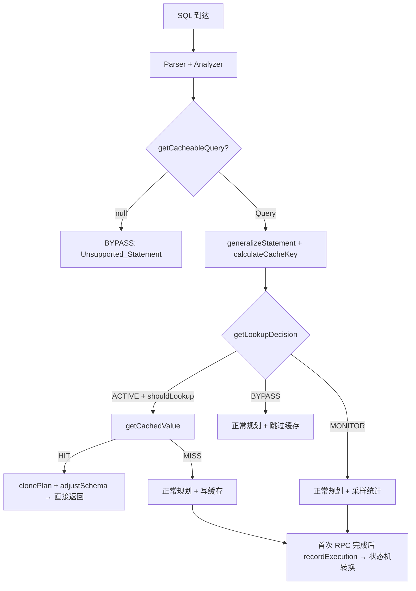
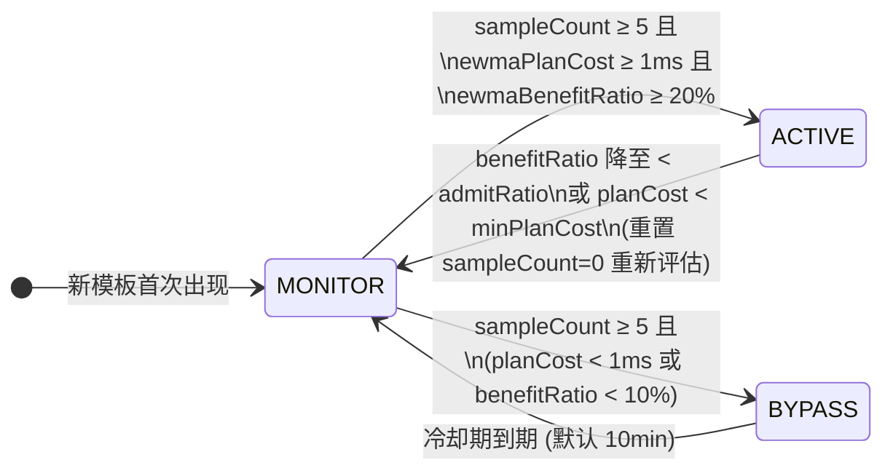

# Plan Cache 加速查询 — 技术设计

## 版本变更记录

| 操作日期 | 文档版本 | 操作人 | 内容 |
|---|---|---|---|
| 2025.10.28 | V0.1（初始版本） | 乐阳 | 创建初始文档 |
| 2026.04.15 | V1.0 | 乐阳 | 完善详细设计、代码实现、测试验证 |

---

## 1. 设计背景

### 1.1 需求关联

- 之前提交的 PlanCache PR：https://github.com/apache/iotdb/pull/16228/
- OceanBase Fast Parameterization / Plan Cache：https://en.oceanbase.com/docs/common-oceanbase-database-10000000001103790
- PostgreSQL generic vs custom plan heuristic：https://www.postgresql.org/docs/current/sql-prepare.html

### 1.2 专有词汇与技术背景

| 术语 | 定义 |
|---|---|
| **Plan Cache** | 缓存优化后的逻辑查询计划模板，避免重复执行 Logical Plan 生成和 Logical Optimization |
| **Query Fingerprint** | 将 SQL 中的字面量参数化后生成的规范化指纹（MD5），结构相同但参数不同的 SQL 映射到同一指纹 |
| **Reusable Planning Cost** | 可复用的 FE 规划成本 = `Logical Plan Cost` + `Logical Optimization Cost` |
| **First Response Latency** | 首包响应耗时：从查询进入 Coordinator 到首次 RPC 结束的服务端耗时 |
| **Benefit Ratio** | 相对收益 = `reusablePlanningCost / firstResponseLatency`，用于判断缓存是否值得 |
| **EWMA** | 指数加权移动平均（Exponential Weighted Moving Average），$\alpha = 0.5$，公式：$V_{new} = V_{old} \times (1-\alpha) + V_{latest} \times \alpha$ |
| **三态状态机** | MONITOR（观察）→ ACTIVE（激活）→ BYPASS（旁路），每个查询模板独立维护 |

### 1.3 问题分析

目前 IoTDB 表模型中，查询的逻辑计划生成（`Logical Plan`）与逻辑优化（`Logical Optimization`）在每次查询时都会完整执行。在时序场景中，存在大量"执行耗时极短，但 FE 逻辑规划耗时较长"的高频查询：

- **典型场景**：`LAST` 查询、带 `device_id` 点查的场景
- **耗时分布特征**：50 列 Schema 的 LAST 查询中，规划耗时（~5ms）占首包响应的 50%+
- **现有 PREPARE/EXECUTE 局限**：仅跳过 Parser 阶段，未跳过逻辑计划生成和逻辑优化

---

## 2. 设计目标

### 2.1 功能目标

1. **缓存优化后的逻辑计划模板**，跳过 `Logical Plan Generation` 和 `Logical Optimization`
2. **智能准入控制**：基于三态状态机（MONITOR / ACTIVE / BYPASS）动态决策，只让高收益模板进入缓存
3. **参数化归一化**：字面量不同但结构相同的 SQL 命中同一模板（如 `device_id = 'd1'` 与 `device_id = 'd2'`）
4. **安全重绑定**：命中缓存后重新绑定设备列表、时间过滤、分区信息
5. **可观测性**：通过 `EXPLAIN ANALYZE VERBOSE` 输出 Plan Cache 状态与节省耗时

### 2.2 非功能目标

1. **内存控制**：LRU 淘汰 + 双重限制（条目数 ≤ 1000，内存 ≤ 64MB）
2. **并发安全**：`ConcurrentHashMap`（模板统计） + `synchronized`（缓存写入）
3. **零侵入**：不缓存 Distribution Plan，避免 Region/分片拓扑变化导致失效
4. **配置外部化**：所有阈值可通过 `iotdb-system.properties` 调整


---

## 3. 架构设计

### 3.1 系统架构概览

Plan Cache 位于 **Analyzer 之后、Distribution Planner 之前**的逻辑规划阶段，作用于表模型查询路径：

```
Client → Parser → Analyzer → [Plan Cache] → Logical Planner → Optimizer → Distribution Planner → Executor
                                  ↑                                                      |
                                  |                                                      |
                                  +------------- adjustSchema (重绑定) ←-----------------+
```

### 3.2 数据流与处理



### 3.3 关键业务流程

1. **查询到达**：Parser + Analyzer 阶段无法跳过（保证 Schema 验证和权限控制）
2. **模板识别**：在 Analyzer 完成后生成 Query Fingerprint（字面量参数化 + Schema 版本号 → MD5）
3. **状态查询**：O(1) 查询模板当前状态（ACTIVE → 查缓存；MONITOR → 正常规划+采样；BYPASS → 直接跳过）
4. **缓存命中**：clone 缓存的计划树，注入新字面量，adjustSchema 重绑定设备/分区
5. **样本反馈**：首次 RPC 完成后，将真实 `firstResponseLatency` 反馈给状态机，驱动 EWMA 更新和状态转换

---

## 4. 详细设计

### 4.1 模块一：PlanCacheManager（缓存管理器 + 状态机）

#### 4.1.1 设计目标

**核心问题**：并非所有 SQL 都值得缓存。如果一个 SQL 规划极快但执行极慢，缓存它不但省不了时间，还浪费内存并增加查找开销。

**目标**：
- 提供 LRU 缓存容器
- 每个查询模板独立维护三态状态机
- 基于 EWMA 代价评估决定模板晋升/降级
- 双重内存限制防止 OOM

#### 4.1.2 接口设计

```java
public class PlanCacheManager {
    // 查询模板当前状态，决定是否需要查缓存
    public LookupDecision getLookupDecision(String cacheKey);

    // 获取缓存的逻辑计划
    public CachedValue getCachedValue(String cacheKey);

    // 记录缓存命中
    public void recordCacheHit(String cacheKey);

    // 记录执行反馈（首次 RPC 完成后调用），返回新状态
    public PlanCacheState recordExecution(
        String cacheKey, long reusablePlanningCost,
        long firstResponseLatency, boolean cacheLookupMiss);

    // 判断是否应该将计划写入缓存
    public boolean shouldCache(String cacheKey);

    // 写入缓存
    public void cacheValue(String cachedKey, PlanNode planNode, ...);

    // 获取预估的可节省规划时间
    public long getEstimatedReusablePlanningCost(String cacheKey);
}
```

**LookupDecision 数据结构**：

```java
public static class LookupDecision {
    private final PlanCacheState state;      // MONITOR / ACTIVE / BYPASS
    private final boolean shouldLookup;       // 是否需要查缓存
    private final String reason;              // BYPASS 原因（如 "Low_Benefit", "Collecting_Samples"）
}
```

#### 4.1.3 细节设计

##### 三态状态机



**状态转换条件详解**：

| 转换 | 条件 |
|---|---|
| MONITOR → ACTIVE | `sampleCount ≥ 5` 且 `ewmaReusablePlanningCost ≥ 1ms` 且 `ewmaBenefitRatio ≥ 0.20` |
| MONITOR → BYPASS | `sampleCount ≥ 5` 且 (`ewmaReusablePlanningCost < 1ms` 或 `ewmaBenefitRatio < 0.10`) |
| ACTIVE → MONITOR | `ewmaReusablePlanningCost < 1ms` 或 `ewmaBenefitRatio < admitRatio`（重置 sampleCount 重新评估） |
| BYPASS → MONITOR | `System.nanoTime() ≥ cooldownDeadline` |

> `admitRatio = 20%` 与 `bypassRatio = 10%` 之间留有 10% 的回差区间，避免在阈值附近反复震荡。

##### EWMA 代价评估

每次查询执行完成后更新三个 EWMA 指标（$\alpha = 0.5$）：

$$ewmaReusablePlanningCost = ewma_{old} \times 0.5 + reusablePlanningCost_{latest} \times 0.5$$

$$ewmaFirstResponseLatency = ewma_{old} \times 0.5 + firstResponseLatency_{latest} \times 0.5$$

$$ewmaBenefitRatio = ewma_{old} \times 0.5 + \frac{reusablePlanningCost_{latest}}{firstResponseLatency_{latest}} \times 0.5$$

##### TemplateProfile 采样字段

```java
private static class TemplateProfile {
    PlanCacheState state;                  // 当前状态
    long sampleCount;                      // 总采样次数
    long hitCount / missCount / bypassCount; // 命中/未命中/旁路计数
    long lastAccessTime;                   // 最近访问时间戳
    long lastStateChangeTime;              // 最近状态变更时间戳
    long cooldownDeadline;                 // BYPASS 冷却截止时间
    double ewmaReusablePlanningCost;       // EWMA 规划成本
    double ewmaFirstResponseLatency;       // EWMA 首包延迟
    double ewmaBenefitRatio;               // EWMA 收益率
}
```

##### LRU 缓存与内存控制

- **缓存容器**：`LinkedHashMap(accessOrder=true)` — 天然 LRU 淘汰
- **双重限制**：
  - 条目数上限：`MAX_CACHE_SIZE = 1000`
  - 内存上限：`MAX_MEMORY_BYTES = 64MB`（使用 `RamUsageEstimator` 精确追踪）
- **淘汰策略**：写入时若超限，循环剔除最久未使用的条目直到满足约束

##### 并发控制

| 数据结构 | 锁策略 | 说明 |
|---|---|---|
| `templateProfiles` | `ConcurrentHashMap` | 高并发读写模板统计 |
| `TemplateProfile` 内部方法 | `synchronized`（实例级） | 单模板粒度锁，不影响其他模板 |
| `planCache` | `synchronized`（全局） | 保证 LRU 链表和内存计数一致性 |

#### 4.1.4 安全性设计

| 自查内容 | 说明 | 自查结果 |
|---|---|---|
| 第三方依赖安全 — 是否引入新库？ | 使用已有的 `RamUsageEstimator`（tsfile）和 `DigestUtils`（commons-codec） | 否 |
| 可用性 — DoS 能力 | LRU 双重限制防止内存溢出；高基数模板场景下 BYPASS 机制避免资源浪费 | 是 |
| 机密性 — 数据传输加密 | Plan Cache 纯内存组件，不涉及网络传输 | 不适用 |

---

### 4.2 模块二：TableLogicalPlanner 接入

#### 4.2.1 设计目标

在表模型逻辑规划入口 `TableLogicalPlanner.plan()` 中接入 Plan Cache 的完整查缓存 / 写缓存 / 统计反馈逻辑。

#### 4.2.2 接口设计

**新增方法**：

```java
// 判断语句是否可缓存（解包 Query / Explain / ExplainAnalyze）
private Query getCacheableQuery(Statement statement);

// 字面量参数化
private List<Literal> generalizeStatement(Query query);

// 生成缓存 Key（参数化 SQL + Schema 版本号 → MD5）
private String calculateCacheKey(Query query, Analysis analysis);

// 克隆计划树并注入新字面量
private PlanNode clonePlanWithNewLiterals(PlanNode plan, ClonerContext context);

// 重绑定设备列表、时间过滤、分区信息
private void adjustSchema(DeviceTableScanNode, metaExprs, attributeCols, assignments, analysis);
```

#### 4.2.3 细节设计

**`plan()` 方法主流程**：

```
1. getCacheableQuery(statement)
   ├── Query → 返回自身
   ├── Explain → 解包内部 Query
   ├── ExplainAnalyze → 解包内部 Query
   └── 其他 → null（BYPASS: Unsupported_Statement）

2. generalizeStatement(query) → 提取字面量列表

3. calculateCacheKey(query, analysis) → MD5 指纹

4. getLookupDecision(cacheKey)
   ├── ACTIVE + shouldLookup:
   │   ├── getCachedValue(cacheKey)
   │   │   ├── HIT + 非 EXPLAIN ANALYZE → clone + adjustSchema → 直接返回
   │   │   ├── HIT + EXPLAIN ANALYZE → 报告 HIT 但走完整规划路径
   │   │   └── MISS → 继续正常规划
   │   └── 统计 lookupCost
   ├── MONITOR → 正常规划，仅采样
   └── BYPASS → 正常规划，跳过缓存

5. 正常规划路径:
   planStatement() → optimizer chain → 记录 reusablePlanningCost
   → 若 shouldCache() → clone + cacheValue()
   → 设置 cachedKey/lookupAttempted 到 queryContext（供 QueryExecution 反馈用）
```

**EXPLAIN ANALYZE 兼容修复**：

`getCacheableQuery()` 将 `EXPLAIN ANALYZE SELECT ...` 和 `SELECT ...` 解包为相同的 `Query`，导致 cache key 相同。修复：在 cache HIT 判断中增加 `!queryContext.isExplainAnalyze()` 检查，EXPLAIN ANALYZE 跳过缓存早返回但仍正确报告 HIT 状态。

```java
if (cachedValue != null && !queryContext.isExplainAnalyze()) {
    // 正常 HIT 路径：clone + adjustSchema → 直接返回
} else if (cachedValue != null) {
    // EXPLAIN ANALYZE：报告 HIT 但走完整 planExplainAnalyze() 路径
    queryContext.setPlanCacheStatus("HIT");
} else {
    queryContext.setPlanCacheStatus("MISS");
}
```

**adjustSchema 重绑定流程**：

缓存命中后，计划树"骨架"相同（FilterNode + DeviceTableScanNode），但需要对每个 `DeviceTableScanNode` 重新绑定：

1. 代入新字面量，重新 `indexScan` 获取匹配的设备列表
2. 重新生成 `TimeFilter`
3. 重新拉取 `DataPartition`
4. 更新到 `Analysis` 对象供 `DistributionPlanner` 使用

---

### 4.3 模块三：QueryExecution 首包耗时采集

#### 4.3.1 设计目标

准入控制的核心指标 `firstResponseLatency` 必须是**真实的首次 RPC 服务端耗时**，而非 FE 侧估算值或多次 RPC 累加的 `totalExecutionTime`。

#### 4.3.2 细节设计

在 `QueryExecution.recordExecutionTime()` 中，检测首次 RPC 完成（`totalExecutionTime == 0`），将本次 RPC 耗时作为 `firstResponseLatency` 反馈给 `PlanCacheManager`：

```java
@Override
public synchronized void recordExecutionTime(long executionTime) {
    boolean isFirstRpc = (totalExecutionTime == 0);
    totalExecutionTime += executionTime;

    if (isFirstRpc) {
        String cachedKey = context.getPlanCacheCachedKey();
        if (cachedKey != null && !cachedKey.isEmpty()) {
            long reusablePlanningCost = context.getReusablePlanningCost();
            boolean lookupAttempted = context.isPlanCacheLookupAttempted();
            context.setFirstResponseLatency(executionTime);

            PlanCacheState newState = PlanCacheManager.getInstance()
                .recordExecution(cachedKey, reusablePlanningCost, executionTime, lookupAttempted);
            context.setPlanCacheState(newState.name());
        }
    }
}
```

**为什么用首次 RPC 而不是 totalExecutionTime**：

一条查询可能经历多轮 RPC（1 次 `executeQueryStatementV2` + N 次 `fetchResultsV2`），`totalExecutionTime` 混入了后续批量拉取的累计开销。对于结果集大但引擎执行快的 SQL，会被误判为"低收益"降入 BYPASS。首次 RPC 耗时是最贴近"规划 + 首包执行"的真实指标。

**数据桥接**（`MPPQueryContext` 新增字段）：

```java
private String planCacheCachedKey = "";           // 缓存指纹 Key
private boolean planCacheLookupAttempted = false;  // 是否尝试过缓存查找
```

这两个字段在 `TableLogicalPlanner` 中设置，在 `QueryExecution.recordExecutionTime()` 中读取，实现 Planner → Execution 的延迟反馈。

---

## 5. 配置管理

### 5.1 全局配置（iotdb-system.properties）

目前缓存不是基于会话的，是全局单例

所有阈值通过 `IoTDBConfig` + `IoTDBDescriptor` 加载：

| 配置项 | 默认值 | 说明 |
|---|---|---|
| `smart_plan_cache_capacity` | 1000 | 缓存条目数上限 |
| `smart_plan_cache_max_memory_bytes` | 67108864 (64MB) | 缓存内存上限 |
| `smart_plan_cache_min_samples` | 5 | 晋升 ACTIVE 所需最小采样次数 |
| `smart_plan_cache_min_reusable_planning_cost_nanos` | 1000000 (1ms) | 晋升 ACTIVE 的最小绝对规划成本（纳秒） |
| `smart_plan_cache_admit_ratio` | 0.20 | 晋升 ACTIVE 的收益率阈值（20%） |
| `smart_plan_cache_bypass_ratio` | 0.10 | 降级 BYPASS 的收益率阈值（10%） |
| `smart_plan_cache_bypass_cooldown_minutes` | 10 | BYPASS 冷却时间（分钟） |
| `smart_plan_cache_mode` | AUTO | 模式（AUTO / OFF / MONITOR / FORCE） |

### 5.2 会话级控制（规划中）

```sql
SET smart_plan_cache_mode = OFF | MONITOR | AUTO | FORCE
```

- `OFF`：关闭缓存
- `MONITOR`：只采样不命中
- `AUTO`：智能状态机（默认）
- `FORCE`：强制缓存所有可缓存语句

---

## 6. 可观测性

### 6.1 EXPLAIN ANALYZE 输出

在 `EXPLAIN ANALYZE [VERBOSE]` 中新增 4 行 Plan Cache 统计：

```
Plan Cache Status: HIT | MISS | BYPASS (reason) | DISABLED
Plan Cache State:  ACTIVE | MONITOR | BYPASS | N/A
Plan Cache Lookup Cost: x.xxx ms
Saved Logical Planning Cost: x.xxx ms
```

**Status 取值说明**：

| Status | 含义 |
|---|---|
| `HIT` | 缓存命中，直接复用逻辑计划 |
| `MISS` | 模板处于 ACTIVE 但缓存中无条目（首次或被淘汰） |
| `BYPASS (Collecting_Samples)` | 模板处于 MONITOR 采样期 |
| `BYPASS (Low_Benefit)` | 模板已降级为 BYPASS |
| `BYPASS (Unsupported_Statement)` | 语句不支持缓存（INSERT / DDL / CTE 等） |
| `DISABLED` | Plan Cache 未启用或非表模型查询 |

---

## 7. 缓存失效

以下情形会导致缓存失效：

1. **Schema 变更**：`DataNodeTableCache` 版本号变化，cache key 中包含版本号，自动失效
2. **LRU 淘汰**：条目数或内存超限时自动剔除最久未使用的条目
3. **ACTIVE → MONITOR 降级**：长期收益下降时重新评估，不再命中缓存
4. **BYPASS 冷却后重评估**：冷却期到达后回到 MONITOR 重新采样
5. **显式清理**：`PlanCacheManager.clear()` 清空所有缓存和统计

**不可缓存的语句类型**：INSERT / DELETE / UPDATE / DDL / CTE / 复杂子查询 / JOIN / 非确定性函数

---

## 8. 涉及的代码文件

| 文件 | 修改内容 |
|---|---|
| `PlanCacheManager.java` | 新增。LRU 缓存 + 三态状态机 + EWMA 评估 |
| `TableLogicalPlanner.java` | 修改 `plan()` 方法接入缓存查找/写入；修复 EXPLAIN ANALYZE + HIT bug |
| `QueryExecution.java` | 修改 `recordExecutionTime()` 在首次 RPC 完成时反馈 firstResponseLatency |
| `MPPQueryContext.java` | 新增 `planCacheCachedKey`、`planCacheLookupAttempted` 字段及 Plan Cache 统计代理方法 |
| `IoTDBConfig.java` | 新增 8 个 `smartPlanCache*` 配置字段及 getter/setter |
| `IoTDBDescriptor.java` | 新增从 `iotdb-system.properties` 加载 `smart_plan_cache_*` 配置 |
| `QueryPlanStatistics.java` | 新增 Plan Cache 相关统计字段 |
| `FragmentInstanceStatisticsDrawer.java` | 在 EXPLAIN ANALYZE 输出中渲染 Plan Cache 统计行 |

---

## 9. 测试验证

### 9.1 测试环境

- IoTDB 2.0.7-SNAPSHOT（ly/planCache2 分支）
- 单机 standalone 部署
- 表结构: `test.t2`

```sql
CREATE TABLE t2 (
    device_id STRING TAG,
    s01 INT32 FIELD, s02 INT32 FIELD, s03 INT32 FIELD, s04 INT32 FIELD, s05 INT32 FIELD,
    s06 INT32 FIELD, s07 INT32 FIELD, s08 INT32 FIELD, s09 INT32 FIELD, s10 INT32 FIELD,
    s11 INT32 FIELD, s12 INT32 FIELD, s13 INT32 FIELD, s14 INT32 FIELD, s15 INT32 FIELD,
    s16 INT32 FIELD, s17 INT32 FIELD, s18 INT32 FIELD, s19 INT32 FIELD, s20 INT32 FIELD,
    s21 INT32 FIELD, s22 INT32 FIELD, s23 INT32 FIELD, s24 INT32 FIELD, s25 INT32 FIELD,
    s26 INT32 FIELD, s27 INT32 FIELD, s28 INT32 FIELD, s29 INT32 FIELD, s30 INT32 FIELD,
    s31 INT32 FIELD, s32 INT32 FIELD, s33 INT32 FIELD, s34 INT32 FIELD, s35 INT32 FIELD,
    s36 INT32 FIELD, s37 INT32 FIELD, s38 INT32 FIELD, s39 INT32 FIELD, s40 INT32 FIELD,
    s41 INT32 FIELD, s42 INT32 FIELD, s43 INT32 FIELD, s44 INT32 FIELD, s45 INT32 FIELD,
    s46 INT32 FIELD, s47 INT32 FIELD, s48 INT32 FIELD, s49 INT32 FIELD, s50 INT32 FIELD
);
```

- 数据量: ~101,000 行（原始 1000 device × 1 行 + 50 device × 2000 行）

### 9.2 正面用例：LAST 点查 → ACTIVE ✓

**查询模板**: `SELECT last(s01), ..., last(s10) FROM t2 WHERE device_id = ?`

**测试流程**: 先执行 10 次普通 SELECT（device_id 从 'd1' 到 'd10' 变换字面量），再执行 EXPLAIN ANALYZE VERBOSE。

**EXPLAIN ANALYZE 输出**:

```
Analyze Cost: 0.822 ms
Fetch Partition Cost: 0.543 ms
Fetch Schema Cost: 0.075 ms
Logical Plan Cost: 1.009 ms
Logical Optimization Cost: 4.007 ms
Distribution Plan Cost: 0.240 ms
Plan Cache Status: HIT
Plan Cache State: ACTIVE
Plan Cache Lookup Cost: 0.001 ms
Saved Logical Planning Cost: 5.017 ms
Dispatch Cost: 2.143 ms
Fragment Instances Count: 1
```

**分析**:

| 指标 | 值 | 说明 |
|---|---|---|
| Plan Cache Status | **HIT** | 缓存命中，直接复用逻辑计划模板 |
| Plan Cache State | **ACTIVE** | 模板已从 MONITOR 晋升为 ACTIVE |
| Saved Logical Planning Cost | **5.017 ms** | 节省约 5ms 规划时间 |
| Logical Plan + Optimization | 1.009 + 4.007 = **5.016 ms** | 与 Saved Cost 吻合 |
| Fragment Instances | 1 | 单设备查询，单分片实例 |

**结论**: 完全符合预期。LAST 点查属于"重规划、轻执行"查询，`benefitRatio` 远大于 `admitRatio(20%)`，5 次采样后晋升 ACTIVE，每次查询可节省 ~5ms FE 规划时间。

### 9.3 反面用例：全表聚合 → MONITOR（采样中）

**查询模板**: `SELECT avg(s01), ..., avg(s50) FROM t2 WHERE time >= ?`

**EXPLAIN ANALYZE 输出**:

```
Analyze Cost: 1.462 ms
Fetch Partition Cost: 0.977 ms
Fetch Schema Cost: 2.621 ms
Logical Plan Cost: 1.549 ms
Logical Optimization Cost: 5.957 ms
Distribution Plan Cost: 0.798 ms
Plan Cache Status: BYPASS (Collecting_Samples)
Plan Cache State: MONITOR
Plan Cache Lookup Cost: 0.000 ms
Saved Logical Planning Cost: 0.000 ms
Dispatch Cost: 1.999 ms
Fragment Instances Count: 4
```

**分析**:

| 指标 | 值 | 说明 |
|---|---|---|
| Plan Cache Status | **BYPASS (Collecting_Samples)** | 仍在采样期 |
| Plan Cache State | **MONITOR** | 观察态 |
| Logical Plan + Optimization | 1.549 + 5.957 = **7.506 ms** | FE 规划耗时 |
| Fragment Instances | 4 | 全表扫描涉及 4 个数据分区 |

**说明**: 100K 行数据下全表聚合执行耗时预期达到几百 ms 级别，`benefitRatio = ~7.5ms / ~200ms ≈ 3.75%` < `bypassRatio(10%)`，采样次数达到 5 次后应降级为 BYPASS。此次输出显示尚在采样期（EXPLAIN ANALYZE 语句本身不参与采样计数），需要继续执行普通 SELECT 积累样本。


