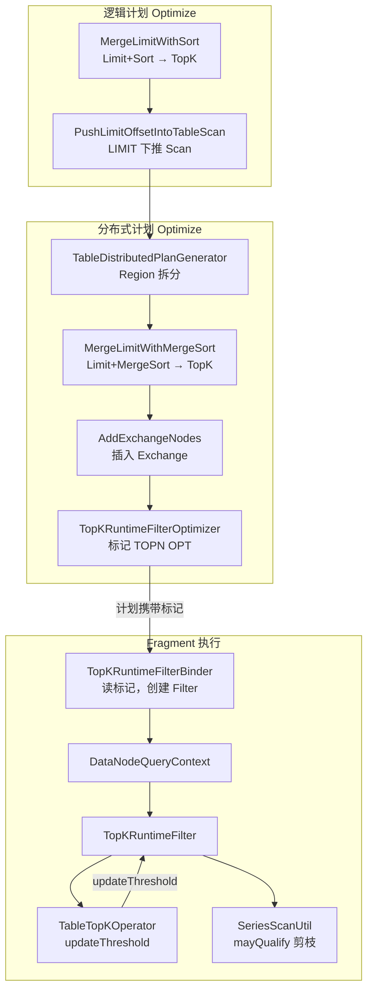
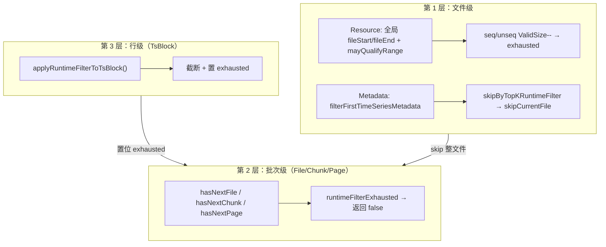

# 查询优化 - TopK Runtime Filter 技术设计

## 设计背景

表模型查询中，`ORDER BY time LIMIT k` 是高频场景，例如：

```sql
SELECT * FROM t1 ORDER BY time DESC LIMIT 10;
SELECT * FROM t1 ORDER BY time ASC LIMIT 10;
```

当前优化路径为：

1. **逻辑计划阶段**：`Limit + Sort` 合并为 `TopKNode`（`MergeLimitWithSort`）
2. **LIMIT 下推**：`PushLimitOffsetIntoTableScan` 将 LIMIT 下推到 `DeviceTableScanNode`，多设备场景设置 `pushLimitToEachDevice = true`
3. **分布式阶段**：`TableDistributedPlanGenerator` 按 Region 拆分 Scan；`MergeLimitWithMergeSort` 将 `Limit + MergeSort` 合并为 `TopK`；`AddExchangeNodes` 插入 Exchange
4. **Coordinator 汇聚**：各 DataNode 本地 TopK 结果经 Exchange 汇聚到 Coordinator TopK

**问题**：当表包含多个设备（Tag 维度）时，每个设备各自返回 `k` 行，Scan 实际读取量为 `k × 设备数`，再由 TopK 合并。设备数量大时，Scan I/O 和 CPU 开销显著，但全局 TopK 最终只需要 `k` 行。

**参考**：Apache Doris TopN Runtime Filter 在 **Optimize 阶段**于计划上标记 `TOPN OPT` / `TOPN OPT: N`，**Execution 阶段**由 TopN 更新阈值、Scan 消费 Filter。Apache DataFusion、GreptimeDB 等引擎采用类似思路。

---

## 设计目标

| 目标 | 说明 |
|------|------|
| **减少 Scan 数据量** | TopK 堆满后，将时间阈值回传 Scan，跳过不可能进入 TopK 的行/文件 |
| **零语义变更** | 结果集与未开启 Runtime Filter 时完全一致，仅影响执行效率 |
| **计划可见** | Optimize 阶段在计划节点上打标，EXPLAIN 可展示 `TOPN OPT` |
| **两段式职责分离** | Optimize 标记 producer/consumer；Execution 创建运行时对象并传递阈值 |
| **低开销通信** | 同 Fragment 内通过共享对象传递阈值，无 RPC、无序列化 |
| **Push 模型** | TopK 写入阈值，Scan 只读；Scan 侧无锁或极少锁竞争 |
| **渐进收紧** | 阈值随 TopK 堆更新单调收紧，剪枝效果随执行推进增强 |
| **向后兼容** | 不满足触发条件时计划无标记，执行路径与现有逻辑一致 |
| **可运维关闭** | 全局热加载开关 `enable_topk_runtime_filter`，默认开启；遇问题可改为 `false` 立即回退 |

---

## 架构设计

### 3.1 两段式设计（对齐 Doris）

| 阶段 | 组件 | 职责 | EXPLAIN 表现 |
|------|------|------|--------------|
| **Optimize** | `TopKRuntimeFilterOptimizer` | 判定是否启用，在计划节点写元数据 | TopK: `TOPN OPT`；Scan: `TOPN OPT: {id}` |
| **Execution** | `TopKRuntimeFilterBinder` + 算子 | 按 root TopK id 注册/查找 `TopKRuntimeFilter`，TopK 更新阈值，Scan 剪枝 | Profile 中可观测过滤行数（待补充） |



### 3.2 计划节点标记

#### TopKNode（producer）

| 字段 | 类型 | 说明 |
|------|------|------|
| `useTopKRuntimeFilter` | `boolean` | 是否启用 Runtime Filter，对应 Doris `TOPN OPT` |
| `topKRuntimeFilterAscending` | `boolean` | 排序方向，决定阈值比较语义 |

#### DeviceTableScanNode（consumer）

| 字段 | 类型 | 说明 |
|------|------|------|
| `topKRuntimeFilterSourceId` | `PlanNodeId` | 关联的 TopK 节点 id，对应 Doris `TOPN OPT: N` |

计划序列化时上述字段一并写入，Fragment 切分后标记随节点传递到各 DataNode。

### 3.3 核心思路

现有 `TopKOperator` 在 `childrenDataInOrder = true` 时，对**已排序子算子**可在本算子内提前终止读取。但 `ORDER BY time`（无 Tag 排序）场景下：

- 多设备 Scan 输出按 `(device, time)` 有序，**非全局 time 有序**
- `childrenDataInOrder = false`，TopK 无法在本 child 内提前终止

**TopK Runtime Filter** 将 TopK 堆顶的「第 k 名时间」作为动态上/下界，通过 `DataNodeQueryContext` 共享给同 Fragment 内被标记的 Scan：

| 排序方向 | 堆满后阈值含义 | Scan 剪枝规则 |
|----------|----------------|---------------|
| `ORDER BY time ASC` | 当前 TopK 中**最大**的时间（第 k 小的上界） | 跳过 `time > threshold` 的数据 |
| `ORDER BY time DESC` | 当前 TopK 中**最小**的时间（第 k 大的下界） | 跳过 `time < threshold` 的数据 |

### 3.4 优化流水线位置

`TableDistributedPlanner.generateDistributedPlanWithOptimize()` 中的调用顺序：

```plaintext
1. TableDistributedPlanGenerator.genResult()     // Region 拆分
2. DistributedOptimizeFactory optimizers         // MergeLimitWithMergeSort 等
3. AddExchangeNodes()                            // 插入 Exchange
4. enable_topk_runtime_filter == true 时：
     TopKRuntimeFilterOptimizer.optimize()       // ← 必须在 Exchange 插入之后
5. SubPlanGenerator.splitToSubPlan()             // Fragment 切分
```

**为何在 AddExchangeNodes 之后标记**：Exchange 插入前，Coordinator TopK 的子树中仍含远程 Scan 节点，无法区分「同 Fragment 本地 Scan」与「跨 Fragment 远程 Scan」。插入 Exchange 后，Coordinator Fragment 的 TopK 子树仅含 Exchange，可正确排除。

### 3.5 执行时序

```mermaid
sequenceDiagram
    participant TDP as TableDistributedPlanner
    participant Opt as TopKRuntimeFilterOptimizer
    participant LP as LocalExecutionPlanner
    participant Binder as TopKRuntimeFilterBinder
    participant Ctx as DataNodeQueryContext
    participant Scan as SeriesScanUtil
    participant TopK as TableTopKOperator
    participant RF as TopKRuntimeFilter

    TDP->>Opt: optimize(plan)  // 计划打标
    Note over Opt: TopKNode.useTopKRuntimeFilter = true<br/>DeviceTableScanNode.topKRuntimeFilterSourceId = topKId

    LP->>Binder: bind(plan, ctx)  // 读标记，创建运行时对象
    Binder->>RF: new TopKRuntimeFilter(ascending)
    Binder->>Ctx: registerTopKRuntimeFilter(topKId, filter)

    loop Scan 读取
        Scan->>RF: mayQualifyRange(fileStart, fileEnd)
        alt 文件不可能命中
            Scan-->>Scan: skipCurrentFile
        else 继续读页
            Scan->>RF: mayQualify(time) 逐行检查
            alt 遇到不可能命中的行
                Scan-->>Scan: runtimeFilterExhausted = true
            end
        end
        Scan-->>TopK: 输出 TsBlock
    end

    loop TopK 消费
        TopK->>TopK: 维护大小为 k 的堆
        alt 堆已满
            TopK->>RF: updateThreshold(peek.time)
        end
    end
```

### 3.6 典型查询计划

```sql
SELECT * FROM t1 ORDER BY time DESC LIMIT 10
```

**逻辑计划**（单 Region）：

```plaintext
Output
 └── TopK (count=10, orderBy=time DESC, TOPN OPT)
      └── Limit
           └── DeviceTableScan (TOPN OPT: {topKId}, pushDownLimit=10, pushLimitToEachDevice=true)
```

**分布式计划**（多 Region）：

```plaintext
Fragment-0 (Coordinator):
  TopK                              ← 子树含 Exchange，不标记 TOPN OPT
   ├── Exchange ── Fragment-1
   └── Exchange ── Fragment-2

Fragment-i (DataNode):
  TopK (TOPN OPT)                   ← 本地 TopK + Scan，标记启用
   └── Limit
        └── DeviceTableScan (TOPN OPT: {topKId})
```

> Coordinator Fragment 的 TopK 子树仅含 Exchange，不满足触发条件，不标记。  
> 各 DataNode Fragment 独立标记、独立创建 Filter，在本地剪枝。

---

## 详细设计

### 4.0 配置项

本特性新增 **DataNode 全局开关**，支持 **热加载**（`effectiveMode: hot_reload`），便于上线后遇问题时无需重启即可关闭优化。

| 配置项 | 默认值 | effectiveMode | Datatype | 作用 |
|--------|--------|---------------|----------|------|
| `enable_topk_runtime_filter` | `true` | `hot_reload` | `bool` | 是否启用 TopK Runtime Filter 优化 |

**行为说明**：

| 取值 | Optimize 阶段 | Execution 阶段 | EXPLAIN |
|------|---------------|----------------|---------|
| `true`（默认） | 满足触发条件时运行 `TopKRuntimeFilterOptimizer`，写入 `TOPN OPT` 标记 | 按标记注册 `TopKRuntimeFilter`，Scan 执行 RF 剪枝 | 可见 `TOPN OPT` / `TOPN OPT: {id}` |
| `false` | 跳过 `TopKRuntimeFilterOptimizer`，计划树无 RF 标记 | 不创建 Filter，Scan/TopK 走原有路径 | 无 `TOPN OPT` |

**配置位置**：

```properties
# conf/iotdb-system.properties
# If true, enable TopK Runtime Filter for table-model ORDER BY time LIMIT queries.
# Set to false to disable this optimization without restart (hot reload).
# effectiveMode: hot_reload
# Datatype: bool
enable_topk_runtime_filter=true
```

**代码接入点**（实现侧）：

| 组件 | 职责 |
|------|------|
| `iotdb-system.properties.template` | 模板与默认值 |
| `IoTDBDescriptor` / `IoTDBConfig` | 加载配置，支持热加载刷新 |
| `TableDistributedPlanner.generateDistributedPlanWithOptimize()` | 在调用 `TopKRuntimeFilterOptimizer` 前判断开关 |

```java
if (IoTDBDescriptor.getInstance().getConfig().isEnableTopKRuntimeFilter()
    && analysis.isQuery()) {
  planWithExchange =
      new TopKRuntimeFilterOptimizer().optimize(planWithExchange, optimizerContext);
}
```

> 关闭开关仅跳过 Optimizer 打标；因计划无标记，Binder / OperatorGenerator / Scan 不会注入 Filter，语义与优化前完全一致。

### 4.1 接口设计

#### 4.1.1 TopKRuntimeFilter（calc-commons，运行时对象）

```java
// org.apache.iotdb.calc.execution.filter.TopKRuntimeFilter
public class TopKRuntimeFilter {

    private final boolean ascending;
    private final AtomicLong threshold;

    public TopKRuntimeFilter(boolean ascending) {
        // ASC: MAX_VALUE → 未 update 前 mayQualify 恒 true；DESC: MIN_VALUE 同理
        threshold = new AtomicLong(ascending ? Long.MAX_VALUE : Long.MIN_VALUE);
    }

    /** 堆满后由 TopK 调用，阈值单调收紧 */
    public void updateThreshold(long time) { ... }

    /** 单行是否仍可能进入 TopK */
    public boolean mayQualify(long time) { ... }

    /** 文件/Chunk 时间范围是否仍可能包含命中行 */
    public boolean mayQualifyRange(long startTime, long endTime) { ... }
}
```

**无需 `isActive()`**：初始哨兵值保证堆未满、尚未 `updateThreshold` 时，`mayQualify` / `mayQualifyRange` 自然不剪枝；TopK 侧仍仅在堆满后调用 `updateThreshold`（见 `TopKOperator.updateTopKRuntimeFilter`）。

**阈值更新规则**：

```java
// ASC：阈值只减不小（上界收紧）
threshold.updateAndGet(prev -> Math.min(prev, time));

// DESC：阈值只增不减（下界收紧）
threshold.updateAndGet(prev -> Math.max(prev, time));
```

#### 4.1.2 TopKRuntimeFilterOptimizer（datanode，Optimize 阶段）

```java
// org.apache.iotdb.db.queryengine.plan.relational.planner.optimizations.TopKRuntimeFilterOptimizer
public class TopKRuntimeFilterOptimizer implements PlanOptimizer {

    @Override
    public PlanNode optimize(PlanNode plan, Context context) {
        // 遍历计划树，对满足条件的 TopKNode 打标
        // 并对其子树中的 DeviceTableScanNode 设置 topKRuntimeFilterSourceId
    }
}
```

**触发条件**（同时满足）：

| 条件 | 说明 |
|------|------|
| `enable_topk_runtime_filter = true` | 全局开关开启（见 [4.0 配置项](#40-配置项)） |
| `ORDER BY time` 单列 | `orderingScheme.getOrderBy().size() == 1` 且列名为 `time`（`TopKRuntimeFilterUtils`） |
| TopK 子树含 `DeviceTableScanNode` | 本 Fragment 有本地 Scan |
| TopK 子树不含 `ExchangeNode` | 排除 Coordinator 纯汇聚 Fragment |

**标记动作**：

```java
topKNode.setUseTopKRuntimeFilter(true);
topKNode.setTopKRuntimeFilterAscending(isAscending);
scanNode.setTopKRuntimeFilterSourceId(topKNode.getPlanNodeId());
```

#### 4.1.3 TopKRuntimeFilterBinder（datanode，Execution 阶段）

```java
// org.apache.iotdb.db.queryengine.plan.planner.TopKRuntimeFilterBinder
public class TopKRuntimeFilterBinder {

    /** 读取计划标记，按 root TopK id 注册运行时 TopKRuntimeFilter */
    public static void bind(PlanNode planRoot, DataNodeQueryContext ctx) {
        // TopKNode: ctx.registerTopKRuntimeFilter(node.getPlanNodeId().getId(), filter)
        // Scan: ctx.getTopKRuntimeFilter(sourceId.getId())
    }
}
```

`DataNodeQueryContext` 在**同一 Query、同一 DataNode** 的所有 Fragment Instance 间共享：

```java
private final Map<String, TopKRuntimeFilter> runtimeFilters = new ConcurrentHashMap<>();

public TopKRuntimeFilter registerTopKRuntimeFilter(String filterId, TopKRuntimeFilter filter) {
    return runtimeFilters.computeIfAbsent(filterId, id -> filter);
}
```

同一 root TopK id 的多个 Fragment 绑定同一 Filter 实例；Scan 通过 `topKRuntimeFilterSourceId` 查找对应 Filter。

#### 4.1.4 TopKOperator 扩展

```java
protected TopKOperator(
    ...,
    boolean childrenDataInOrder,
    TopKRuntimeFilter topKRuntimeFilter) { ... }

private void updateTopKRuntimeFilter() {
    if (topKRuntimeFilter == null || mergeSortHeap.getHeapSize() < topValue) {
        return;
    }
    MergeSortKey peek = mergeSortHeap.peek();
    topKRuntimeFilter.updateThreshold(peek.tsBlock.getTimeByIndex(peek.rowIndex));
}
```

每消费一批 child 数据后调用 `updateTopKRuntimeFilter()`，与 `childrenDataInOrder` 的 `skipCurrentBatch` 逻辑互补。

#### 4.1.5 SeriesScanOptions / SeriesScanUtil 扩展

```java
// SeriesScanOptions.Builder
public Builder withTopKRuntimeFilter(TopKRuntimeFilter filter) { ... }
```

Scan 侧仅在 `DeviceTableScanNode.getTopKRuntimeFilterSourceId()` 有值时注入 Filter。

#### 4.1.5 Scan 侧剪枝

Scan 读取路径为 `TsFileResource → TimeSeriesMetadata → Chunk → Page → TsBlock（行）`，Runtime Filter 在三个粒度上剪枝，粒度越粗 IO 节省越大。

**前置条件**：TopK 堆满后开始 `updateThreshold`，阈值才从哨兵值收紧；单条时序内 time 单调有序（ASC/DESC）。

| 层级 | 位置 | 逻辑 |
|------|------|------|
| **文件级** | **Resource**：`hasNextSeqResource` / `hasNextUnseqResource`（`QueryDataSource.isSeqSatisfiedByRuntimeFilter` / `isUnSeqSatisfiedByRuntimeFilter`）<br>**Metadata**：`filterFirstTimeSeriesMetadata()` → `skipByTopKRuntimeFilter` → `skipCurrentFile()`<br>**聚合 shortcut**：`canUseCurrentFileStatistics()`（当前未接入 RF） | 1. `mayQualifyRange(startTime, endTime)` 为 false → 跳过整文件（不解码 Chunk/Page）<br>2. Resource 层 skip 时 `seqValidSize--` / `unseqValidSize--`；两者均为 0 时置 `runtimeFilterExhausted = true`<br>3. Resource 通过后 Metadata 层用 measurement 级 Statistics 再判一次（更精确；重叠/modified 文件跳过 Metadata RF） |
| **批次级** | `hasNextFile` / `hasNextChunk` / `hasNextPage` 入口；Chunk/Page 上另有 `skipByTopKRuntimeFilter` | 1. Chunk/Page 统计 `mayQualifyRange` 为 false → `skipCurrentChunk` / `skipCurrentPage`<br>2. `runtimeFilterExhausted == true`（或 `seqValidSize == 0 && unseqValidSize == 0`）→ 直接返回 false |
| **行级** | `applyRuntimeFilterToTsBlock()` | 1. 逐行 `mayQualify(time)`，保留 qualify 前缀<br>2. 遇到首个不 qualify 行 → 截断 TsBlock，并置 `runtimeFilterExhausted = true` |

**Resource 与 Metadata 两层关系**：Resource 层用 TsFile **全局** TimeIndex 在 `loadTimeSeriesMetadata()` 之前做粗筛（与 device 无关，同一文件对所有 device 结论一致）；Metadata 层用已加载的 `TimeSeriesMetadata.Statistics`（measurement 级）做细筛。Resource 通过后 Metadata 仍可能需要 skip（例如 file 全局范围宽于 measurement 范围等）。



##### 第 1 层：文件级（Resource + Metadata）

**Resource 层（`QueryDataSource` + `SeriesScanUtil` 选文件）**

| 项 | 说明 |
|----|------|
| **入口** | `OrderUtils.hasNextSeqResource()` / `hasNextUnseqResource()` |
| **判定** | 在 `globalTimeFilter` 通过后，调用 `isSeqSatisfiedByRuntimeFilter` / `isUnSeqSatisfiedByRuntimeFilter`，内部用 `TsFileResource` **全局** `[fileStartTime, fileEndTime]`（`getFileStartTime()` / `getFileEndTime()`，未关闭文件 endTime 取 `Long.MAX_VALUE`）做 `mayQualifyRange` |
| **动作** | seq：首个 RF 不满足时 `truncateSeqValidSizeForRuntimeFilter(index, ascending)` 并 break（ASC 设 `validSize=index`，DESC 设 `validSize=size-index-1`）；unseq 仍逐个 `decreaseValidSizeForRuntimeFilter`；已剪枝区间由 `isRuntimeFilterPruned` 快速跳过 |
| **计数** | `seqValidSize` / `unseqValidSize` 即跨 device 的 **RF 剪枝水位线**；文件列表按时间有序，RF 从一端单调剪枝（ASC 剪后缀、DESC 剪前缀），每个 TsFile 至多递减一次 |
| **文件游标** | `curSeqFileIndex` / `curUnseqFileIndex` 每 device 仍从列表头/尾开始；迭代中通过 `isRuntimeFilterPruned`（由 validSize 推导边界）快速跳过已剪枝区间 |
| **全局结束** | 两者均为 0 表示所有 seq/unseq 文件均已在 Resource 层被 RF 剪枝 → **直接结束本次 Scan**，`currentDeviceIndex = deviceCount`，无需扫描后续 device |

**Global 算子级早停（`AbstractTableScanOperator`）**

| 项 | 说明 |
|----|------|
| **触发** | 存在 RF 且 `QueryDataSource.hasValidResource() == false`（`seqValidSize == 0 && unseqValidSize == 0`） |
| **判定** | `shouldStopScanByRuntimeFilter()`：`topKRuntimeFilter != null && !queryDataSource.hasValidResource()` |
| **动作** | `currentDeviceIndex = deviceCount`；`isFinished() == true` → `hasNext() == false` |
| **入口** | `initQueryDataSource` / `next()` / `moveToNextDevice` / **`isFinished()` 直接判定** |

**`hasNext` / `isFinished` 结束语义**

每个 device 有独立 `SeriesScanUtil`，共享同一 `QueryDataSource`。文件级 RF 在 Resource / Metadata 两层剪枝后，当 **Region 内全部 seq/unseq TsFile 均已在 Resource 层被 RF 排除**（`validSize` 双零），整个 `AbstractTableScanOperator` 应立即结束，不再切换后续 device：

```plaintext
SeriesScanUtil（单 device）
  Resource 层 RF skip → decreaseValidSize → validSize 双零 → runtimeFilterExhausted = true
  Metadata 层 RF skip → skipCurrentFile（继续尝试同 device 其他文件；不递减 validSize）
  hasNextFile() == false（runtimeFilterExhausted 或正常耗尽）

AbstractTableScanOperator（跨 device）
  initQueryDataSource / moveToNextDevice → setupCurrentDeviceScan（逐 device 切换）
  shouldStopScanByRuntimeFilter() == true
    → currentDeviceIndex = deviceCount（在 next/moveToNextDevice 等入口）
    → isFinished() == true（含 isFinished 内直接调用 shouldStopScanByRuntimeFilter）
    → hasNext() == false
```

| 层级 | 文件级剪枝 | 对 QueryDataSource.validSize 的影响 | 对算子结束的影响 |
|------|-----------|-------------------------------------|------------------|
| Resource | `isResourceSatisfiedByRuntimeFilter` 失败 | `decreaseValidSize(isSeq)` | 双零 → 全局结束 |
| Metadata | `skipByTopKRuntimeFilter` → `skipCurrentFile` | 无（文件已在 Resource 层通过） | 仅结束当前 device 的文件迭代 |
| 算子 | `shouldStopScanByRuntimeFilter` | — | `hasNext=false`, `isFinished=true` |

**Metadata 层（`TimeSeriesMetadata` 统计）**

| 项 | 说明 |
|----|------|
| **入口** | `hasNextFile()` → `filterFirstTimeSeriesMetadata()` |
| **判定** | `skipByTopKRuntimeFilter(firstTimeSeriesMetadata.getStatistics(), skipCurrentFile)`；要求文件非重叠且非 modified |
| **动作** | `mayQualifyRange` 为 false → `skipCurrentFile()`，不解码 Chunk/Page |
| **与 Resource 关系** | 互补：Resource 省 `loadTimeSeriesMetadata`；Metadata 用更精确的 measurement 统计做二次剪枝 |

**聚合 Scan shortcut**

| 项 | 说明 |
|----|------|
| **入口** | `canUseCurrentFileStatistics()`（聚合路径） |
| **场景** | `AbstractAggTableScanOperator` 等；当前 **未** 接入 RF，仅 globalTimeFilter + pushDownFilter |

##### 文件级剪枝完整源码

文件级剪枝分 **Resource 层**（TsFileResource 全局 time 范围，在 `loadTimeSeriesMetadata` 之前）和 **Metadata 层**（TimeSeriesMetadata Statistics，load 之后二次剪枝），外加 **Global 算子级早停**（validSize 双零结束整个 Scan）。

**源码文件清单**

| # | 文件 | 职责 |
|---|------|------|
| 1 | `calc-commons/.../TopKRuntimeFilter.java` | 阈值原语 `mayQualifyRange` |
| 2 | `calc-commons/.../TopKOperator.java` | Producer：堆满后 `updateThreshold` |
| 3 | `datanode/.../DataNodeQueryContext.java` | 跨算子共享 Filter 实例 |
| 4 | `datanode/.../DataNodeTableOperatorGenerator.java` | Consumer：注入 `SeriesScanOptions` |
| 5 | `datanode/.../SeriesScanOptions.java` | Scan 侧持有 `topKRuntimeFilter` |
| 6 | `datanode/.../QueryDataSource.java` | validSize 计数 + Resource 级 RF 判定 |
| 7 | `datanode/.../SeriesScanUtil.java` | Resource 选文件 + Metadata 剪枝 |
| 8 | `datanode/.../AbstractTableScanOperator.java` | Global 早停 + 切 device |

**调用时序**

```plaintext
TopKOperator.updateTopKRuntimeFilter()          ← 堆满后收紧 threshold
  ↓ (共享 TopKRuntimeFilter)
hasNextFile()
  ├─ [Resource] OrderUtils.hasNextSeq/UnseqResource
  │    ├─ globalTimeFilter (device 级)
  │    ├─ mayQualifyRange(fileStartTime, fileEndTime)  ← TsFile 全局
  │    └─ decreaseValidSize → validSize 双零 → runtimeFilterExhausted
  ├─ loadTimeSeriesMetadata()                     ← 仅 Resource 通过后
  ├─ [Metadata] filterFirstTimeSeriesMetadata()
  │    └─ skipByTopKRuntimeFilter(Statistics) → skipCurrentFile
  └─ runtimeFilterExhausted → hasNextFile 返回 false

AbstractTableScanOperator
  ├─ initQueryDataSource → setupCurrentDeviceScan()
  ├─ next() device 读完 → moveToNextDevice()（内含 shouldStopScanByRuntimeFilter 判定）
  └─ moveToNextDevice → setupCurrentDeviceScan()
```

---

**1. 判定原语 — `iotdb-core/calc-commons/src/main/java/org/apache/iotdb/calc/execution/filter/TopKRuntimeFilter.java`**

```java
public class TopKRuntimeFilter {
  private final boolean ascending;
  private final AtomicLong threshold;

  public TopKRuntimeFilter(boolean ascending) {
    this.ascending = ascending;
    threshold = new AtomicLong(ascending ? Long.MAX_VALUE : Long.MIN_VALUE);
  }

  public boolean isAscending() {
    return ascending;
  }

  /** Update threshold with the current heap-top time. Only tightens the bound. */
  public void updateThreshold(long time) {
    if (ascending) {
      // ASC TopK: keep smallest K rows, threshold is the largest time among them
      threshold.updateAndGet(prev -> Math.min(prev, time));
    } else {
      // DESC TopK: keep largest K rows, threshold is the smallest time among them
      threshold.updateAndGet(prev -> Math.max(prev, time));
    }
  }

  public boolean mayQualify(long time) {
    long current = threshold.get();
    return ascending ? time < current : time > current;
  }

  public boolean mayQualifyRange(long startTime, long endTime) {
    long current = threshold.get();
    return ascending ? startTime < current : endTime > current;
  }

  public long getThreshold() {
    return threshold.get();
  }
}
```

---

**2. Producer 更新阈值 — `iotdb-core/calc-commons/src/main/java/org/apache/iotdb/calc/execution/operator/process/TopKOperator.java`**

```java
private void updateTopKRuntimeFilter() {
  if (topKRuntimeFilter == null || mergeSortHeap.getHeapSize() < topValue) {
    return;
  }
  MergeSortKey peek = mergeSortHeap.peek();
  if (peek != null) {
    topKRuntimeFilter.updateThreshold(peek.tsBlock.getTimeByIndex(peek.rowIndex));
  }
}
```

---

**3. Filter 共享与注入**

`iotdb-core/datanode/src/main/java/org/apache/iotdb/db/queryengine/execution/fragment/DataNodeQueryContext.java`

```java
private final Map<String, TopKRuntimeFilter> runtimeFilters = new ConcurrentHashMap<>();

public TopKRuntimeFilter registerTopKRuntimeFilter(String filterId, TopKRuntimeFilter filter) {
  return runtimeFilters.computeIfAbsent(filterId, id -> filter);
}

public TopKRuntimeFilter getTopKRuntimeFilter(String filterId) {
  return runtimeFilters.get(filterId);
}
```

`iotdb-core/datanode/src/main/java/org/apache/iotdb/db/queryengine/plan/planner/DataNodeTableOperatorGenerator.java`

```java
private TopKRuntimeFilter registerTopKRuntimeFilterForTopK(
    TopKNode node, LocalExecutionPlanContext context) {
  if (node == null || !node.isUseTopKRuntimeFilter() || context.dataNodeQueryContext == null) {
    return null;
  }
  return context.dataNodeQueryContext.registerTopKRuntimeFilter(
      node.getPlanNodeId().getId(), new TopKRuntimeFilter(node.isTopKRuntimeFilterAscending()));
}

private TopKRuntimeFilter resolveTopKRuntimeFilterForDeviceScan(
    DeviceTableScanNode scanNode, LocalExecutionPlanContext context) {
  if (scanNode == null
      || context.dataNodeQueryContext == null
      || !scanNode.getTopKRuntimeFilterSourceId().isPresent()) {
    return null;
  }
  return context.dataNodeQueryContext.getTopKRuntimeFilter(
      scanNode.getTopKRuntimeFilterSourceId().get().getId());
}

private void applyTopKRuntimeFilter(
    SeriesScanOptions.Builder builder,
    DeviceTableScanNode scanNode,
    LocalExecutionPlanContext context,
    TopKRuntimeFilter preResolvedFilter) {
  TopKRuntimeFilter filter =
      preResolvedFilter != null
          ? preResolvedFilter
          : resolveTopKRuntimeFilterForDeviceScan(scanNode, context);
  if (filter != null) {
    builder.withTopKRuntimeFilter(filter);
  }
}

@Override
public Operator visitTopK(TopKNode node, LocalExecutionPlanContext context) {
  TopKRuntimeFilter filter = registerTopKRuntimeFilterForTopK(node, context);
  // ... 构造 TableTopKOperator(..., filter)
}

@Override
public Operator visitDeviceTableScan(
    DeviceTableScanNode node, LocalExecutionPlanContext context) {
  TopKRuntimeFilter topKRuntimeFilter = resolveTopKRuntimeFilterForDeviceScan(node, context);
  AbstractTableScanOperator.AbstractTableScanOperatorParameter parameter =
      constructAbstractTableScanOperatorParameter(node, context, topKRuntimeFilter);
  // applyTopKRuntimeFilter(scanOptionsBuilder, scanNode, context, topKRuntimeFilter);
  return new TableScanOperator(parameter);
}
```

`iotdb-core/datanode/src/main/java/org/apache/iotdb/db/queryengine/plan/planner/plan/parameter/SeriesScanOptions.java`

```java
private final TopKRuntimeFilter topKRuntimeFilter;

public TopKRuntimeFilter getTopKRuntimeFilter() {
  return topKRuntimeFilter;
}

public Builder withTopKRuntimeFilter(TopKRuntimeFilter topKRuntimeFilter) {
  this.topKRuntimeFilter = topKRuntimeFilter;
  return this;
}
```

---

**4. Resource 层 — `iotdb-core/datanode/src/main/java/org/apache/iotdb/db/storageengine/dataregion/read/QueryDataSource.java`**

```java
private int seqValidSize;
private int unseqValidSize;

private void initValidSize() {
  seqValidSize = getSeqResourcesSize();
  unseqValidSize = getUnseqResourcesSize();
}

public int getSeqValidSize() {
  return seqValidSize;
}

public int getUnseqValidSize() {
  return unseqValidSize;
}

public boolean hasValidResource() {
  return seqValidSize > 0 || unseqValidSize > 0;
}

public void decreaseValidSize(boolean isSeq) {
  if (isSeq) {
    if (seqValidSize > 0) {
      seqValidSize--;
    }
  } else if (unseqValidSize > 0) {
    unseqValidSize--;
  }
}

public boolean isSeqSatisfiedByRuntimeFilter(
    IDeviceID deviceID, int curIndex, TopKRuntimeFilter filter, boolean debug) {
  return isResourceSatisfiedByRuntimeFilter(deviceID, curIndex, filter, true, debug);
}

public boolean isUnSeqSatisfiedByRuntimeFilter(
    IDeviceID deviceID, int curIndex, TopKRuntimeFilter filter, boolean debug) {
  return isResourceSatisfiedByRuntimeFilter(deviceID, curIndex, filter, false, debug);
}

public void reset() {
  curSeqIndex = -1;
  curSeqOrderTime = 0;
  curSeqSatisfied = null;
  curUnSeqIndex = -1;
  curUnSeqOrderTime = 0;
  curUnSeqSatisfied = null;
}

private boolean isResourceSatisfiedByRuntimeFilter(
    IDeviceID deviceID, int curIndex, TopKRuntimeFilter filter, boolean isSeq, boolean debug) {
  if (filter == null) {
    return true;
  }
  TsFileResource tsFileResource =
      isSeq ? seqResources.get(curIndex) : unseqResources.get(unSeqFileOrderIndex[curIndex]);
  if (tsFileResource == null) {
    return false;
  }
  // Resource-level RF uses the TsFile's global time range, not per-device bounds.
  long startTime = tsFileResource.getFileStartTime();
  long endTime = tsFileResource.isClosed() ? tsFileResource.getFileEndTime() : Long.MAX_VALUE;
  return filter.mayQualifyRange(startTime, endTime);
}
```

---

**5. Resource 层 — `iotdb-core/datanode/src/main/java/org/apache/iotdb/db/queryengine/execution/operator/source/SeriesScanUtil.java`**

```java
public Optional<Boolean> hasNextFile() throws IOException {
  if (runtimeFilterExhausted || !paginationController.hasCurLimit()) {
    return Optional.of(false);
  }

  if (!unSeqPageReaders.isEmpty()
      || firstPageReader != null
      || mergeReader.hasNextTimeValuePair()) {
    throw new IllegalStateException(
        "all cached pages should be consumed first unSeqPageReaders.isEmpty() is "
            + unSeqPageReaders.isEmpty()
            + " firstPageReader != null is "
            + (firstPageReader != null)
            + " mergeReader.hasNextTimeValuePair() = "
            + mergeReader.hasNextTimeValuePair());
  }

  if (firstChunkMetadata != null || !cachedChunkMetadata.isEmpty()) {
    throw new IllegalStateException(
        DataNodeQueryMessages.ALL_CACHED_CHUNKS_SHOULD_BE_CONSUMED_FIRST);
  }

  if (firstTimeSeriesMetadata != null) {
    return Optional.of(true);
  }

  boolean checked = false;
  if (orderUtils.hasNextSeqResource()
      || orderUtils.hasNextUnseqResource()
      || !seqTimeSeriesMetadata.isEmpty()
      || !unSeqTimeSeriesMetadata.isEmpty()) {
    tryToUnpackAllOverlappedFilesToTimeSeriesMetadata();
    filterFirstTimeSeriesMetadata();
    checked = true;
  }

  if (checked && firstTimeSeriesMetadata == null) {
    return Optional.empty();
  }
  return Optional.of(firstTimeSeriesMetadata != null);
}

private boolean mayQualifyRuntimeFilterRange(Statistics<? extends Serializable> statistics) {
  TopKRuntimeFilter filter = scanOptions.getTopKRuntimeFilter();
  if (filter == null) {
    return true;
  }
  return filter.mayQualifyRange(statistics.getStartTime(), statistics.getEndTime());
}

private void skipByTopKRuntimeFilter(
    Statistics<? extends Serializable> statistics, Runnable skip) {
  if (!mayQualifyRuntimeFilterRange(statistics)) {
    skip.run();
  }
}

public void skipCurrentFile() {
  firstTimeSeriesMetadata = null;
}

// DescTimeOrderUtils — 在原有 isSeqSatisfied / isUnSeqSatisfied 逻辑上叠加 RF
public boolean hasNextSeqResource() {
  while (dataSource.hasNextSeqResource(curSeqFileIndex, false, deviceID)) {
    if (dataSource.isSeqSatisfied(
        deviceID, curSeqFileIndex, scanOptions.getGlobalTimeFilter(), false)) {
      TopKRuntimeFilter filter = scanOptions.getTopKRuntimeFilter();
      if (filter == null
          || dataSource.isSeqSatisfiedByRuntimeFilter(
              deviceID, curSeqFileIndex, filter, false)) {
        break;
      }
      dataSource.truncateSeqValidSizeForRuntimeFilter(curSeqFileIndex, false);
      if (!dataSource.hasValidResource()) {
        runtimeFilterExhausted = true;
      }
      curSeqFileIndex = -1;
      break;

public boolean hasNextUnseqResource() {
  while (dataSource.hasNextUnseqResource(curUnseqFileIndex, false, deviceID)) {
    if (dataSource.isUnSeqSatisfied(
        deviceID, curUnseqFileIndex, scanOptions.getGlobalTimeFilter(), false)) {
      TopKRuntimeFilter filter = scanOptions.getTopKRuntimeFilter();
      if (filter == null
          || dataSource.isUnSeqSatisfiedByRuntimeFilter(
              deviceID, curUnseqFileIndex, filter, false)) {
        break;
      }
      dataSource.decreaseValidSize(false);
      if (!dataSource.hasValidResource()) {
        runtimeFilterExhausted = true;
      }
    }
    curUnseqFileIndex++;
  }
  return dataSource.hasNextUnseqResource(curUnseqFileIndex, false, deviceID);
}

// AscTimeOrderUtils — 同上，seq/unseq 索引均为 ++
public boolean hasNextSeqResource() {
  while (dataSource.hasNextSeqResource(curSeqFileIndex, true, deviceID)) {
    if (dataSource.isSeqSatisfied(
        deviceID, curSeqFileIndex, scanOptions.getGlobalTimeFilter(), false)) {
      TopKRuntimeFilter filter = scanOptions.getTopKRuntimeFilter();
      if (filter == null
          || dataSource.isSeqSatisfiedByRuntimeFilter(
              deviceID, curSeqFileIndex, filter, false)) {
        break;
      }
      dataSource.truncateSeqValidSizeForRuntimeFilter(curSeqFileIndex, true);
      if (!dataSource.hasValidResource()) {
        runtimeFilterExhausted = true;
      }
      curSeqFileIndex = dataSource.getSeqResourcesSize();
      break;
```

---

**6. Metadata 层 — `SeriesScanUtil.java`（同上文件）**

```java
private void filterFirstTimeSeriesMetadata() {
  if (firstTimeSeriesMetadata == null) {
    return;
  }
  if (currentFileOverlapped() || firstTimeSeriesMetadata.isModified()) {
    return;
  }

  skipByTopKRuntimeFilter(firstTimeSeriesMetadata.getStatistics(), this::skipCurrentFile);
  if (firstTimeSeriesMetadata == null) {
    return;
  }

  Filter pushDownFilter = scanOptions.getPushDownFilter();
  if (pushDownFilter != null && pushDownFilter.canSkip(firstTimeSeriesMetadata)) {
    this.context
        .getQueryStatistics()
        .addFilteredRowsOfTimeSeriesLevel(firstTimeSeriesMetadata.getStatistics().getCount());
    skipCurrentFile();
    return;
  }

  Filter globalTimeFilter = scanOptions.getGlobalTimeFilter();
  if (filterAllSatisfy(globalTimeFilter, firstTimeSeriesMetadata)
      && filterAllSatisfy(pushDownFilter, firstTimeSeriesMetadata)
      && timeAllSelected(firstTimeSeriesMetadata)) {
    long rowCount = firstTimeSeriesMetadata.getStatistics().getCount();
    if (paginationController.hasCurOffset(rowCount)) {
      skipCurrentFile();
      paginationController.consumeOffset(rowCount);
    }
  }
}
```

---

**7. Global 算子级早停 — `iotdb-core/datanode/src/main/java/org/apache/iotdb/db/queryengine/execution/operator/source/relational/AbstractTableScanOperator.java`**

```java
@Override
public boolean hasNext() throws Exception {
  return !isFinished();
}

@Override
public boolean isFinished() throws Exception {
  if (retainedTsBlock != null) {
    return false;
  }
  if (seriesScanOptions.limitConsumedUp()) {
    return true;
  }
  if (currentDeviceIndex >= deviceCount) {
    return true;
  }
  // QueryDataSource 中 seq/unseq 均无 RF 候选文件时，立即结束（hasNext → false）
  return shouldStopScanByRuntimeFilter();
}

// AbstractTableScanOperator.next() 片段
if (measurementDataBuilder.isEmpty()
    && measurementDataBlock == null
    && currentDeviceNoMoreData) {
  moveToNextDevice();
}

@Override
public void initQueryDataSource(IQueryDataSource dataSource) {
  this.queryDataSource = (QueryDataSource) dataSource;
  if (shouldStopScanByRuntimeFilter()) {
    currentDeviceIndex = deviceCount;
    return;
  }
  if (currentDeviceIndex < deviceCount) {
    setupCurrentDeviceScan();
  }
  this.resultTsBlockBuilder = new TsBlockBuilder(getResultDataTypes());
  this.resultTsBlockBuilder.setMaxTsBlockLineNumber(this.maxTsBlockLineNum);
  this.measurementDataBuilder = new TsBlockBuilder(this.measurementColumnTSDataTypes);
  this.measurementDataBuilder.setMaxTsBlockLineNumber(this.maxTsBlockLineNum);
}

protected void moveToNextDevice() {
  if (shouldStopScanByRuntimeFilter()) {
    currentDeviceIndex = deviceCount;
    return;
  }
  currentDeviceIndex++;
  if (currentDeviceIndex < deviceCount) {
    setupCurrentDeviceScan();
  }
}

private boolean shouldStopScanByRuntimeFilter() {
  return seriesScanOptions.getTopKRuntimeFilter() != null
      && queryDataSource != null
      && !queryDataSource.hasValidResource();
}
```

---

**两层 Resource / Metadata 对比**

| | Resource 层 | Metadata 层 |
|---|-------------|-------------|
| **时机** | `loadTimeSeriesMetadata` 之前 | load 之后 |
| **数据** | TsFileResource 全局 `getFileStartTime()` / `getFileEndTime()` | TimeSeriesMetadata Statistics |
| **skip 动作** | 推进文件索引 + `decreaseValidSize` | `skipCurrentFile()` |
| **特殊** | 未 closed 文件 `endTime = Long.MAX_VALUE` | 重叠/modified 文件跳过 RF |
| **全局结束** | validSize 双零 → `runtimeFilterExhausted` + 算子级 `currentDeviceIndex = deviceCount` | — |

**ASC vs DESC 索引推进**（Resource RF skip 时）：ASC seq `++` / DESC seq `--`；unseq 均为 `++`。

##### 第 2 层：批次级（File / Chunk / Page 迭代）

| 项 | 说明 |
|----|------|
| **入口** | `hasNextFile()`、`hasNextChunk()`、`hasNextPage()` 开头；Chunk/Page 上 `skipByTopKRuntimeFilter` |
| **判定** | ① Chunk/Page 统计 `mayQualifyRange` 为 false → skip 当前 Chunk/Page<br>② `runtimeFilterExhausted == true` 或 `seqValidSize == 0 && unseqValidSize == 0` |
| **动作** | 直接返回 `false`，不再打开后续 File / Chunk / Page |
| **触发来源** | 文件级 seq/unseq validSize 均耗尽，或行级剪枝置位 `runtimeFilterExhausted` |

```java
if (runtimeFilterExhausted || !paginationController.hasCurLimit()) {
    return Optional.of(false);  // hasNextFile / hasNextChunk
    // 或 return false;          // hasNextPage
}
```

这是 **TableScan 路径的主要提前停止机制**：一旦在某条时序的有序扫描中判定「后续 time 都不可能进 TopK」，整条时序的 IO 迭代立即终止。切换 device 时新建 `SeriesScanUtil`，`runtimeFilterExhausted` 随新实例重置为 `false`。

##### 第 3 层：行级（TsBlock 截断）

| 项 | 说明 |
|----|------|
| **入口** | `filterAndPaginateCachedBlock()` → `applyRuntimeFilterToTsBlock()` |
| **判定** | 按 Scan 顺序逐行调用 `filter.mayQualify(time)` |
| **动作** | 保留 qualify 的前缀行；遇到第一个不 qualify 的行 → 截断 TsBlock + `runtimeFilterExhausted = true` |
| **阈值语义** | ASC：`time < threshold` qualify；DESC：`time > threshold` qualify（严格比较，不含等于） |

```java
for (int i = 0; i < positionCount; i++) {
    if (!filter.mayQualify(tsBlock.getTimeByIndex(i))) {
        keepCount = i;
        runtimeFilterExhausted = true;  // 触发第 2 层终止
        break;
    }
}
return keepCount == positionCount ? tsBlock : tsBlock.getRegion(0, keepCount);
```

**为何可安全终止**：单条时序内 time 单调。ASC 扫描中，第一个 `time > threshold` 之后的行 time 只会更大；DESC 中，第一个 `time < threshold` 之后的行 time 只会更小——都不可能进入 TopK。

##### 三层协作时序

```plaintext
Filter 未激活（TopK 堆未满）
  → 三层均不生效，正常 Scan

Filter 激活后：
  ① Resource 文件级：mayQualifyRange 为 false → 跳过 TsFile，seq/unseq ValidSize--
  ② Metadata 文件级：load 后 mayQualifyRange 为 false → skipCurrentFile
  ③ Chunk/Page 批次级：统计 mayQualifyRange 为 false → skipCurrentChunk/Page
  ④ 打开并解码 TsBlock → 行级 applyRuntimeFilterToTsBlock 截断
  ⑤ seqValidSize==0 && unseqValidSize==0 或 runtimeFilterExhausted → hasNextFile/Chunk/Page 返回 false
  ⑥ moveToNextDevice → setupCurrentDeviceScan；无候选 device 由 hasNextSeqResource 逐文件 skip，validSize 双零时 shouldStopScanByRuntimeFilter 全局早停
```

##### 与 Doris 剪枝层级对照

| 层级 | Doris | IoTDB（当前） |
|------|-------|---------------|
| 文件/Segment | Zonemap min/max → 跳过 Segment | TsFile TimeSeriesStatistics → `mayQualifyRange`（聚合路径） |
| Page | Page 级 Zonemap | 未单独实现，依赖 exhausted 终止 |
| Row | 逐行 RuntimePredicate | `applyRuntimeFilterToTsBlock` 逐行 `mayQualify` |

**后续增强**：在 `filterFirstTimeSeriesMetadata()` 接入 RF 文件跳过（TableScan 路径）；TsFile Chunk/Page 级 min/max 统计剪枝（对齐 Doris Page 级）。

---

### 4.2 细节设计

#### 4.2.1 Filter 传递链

```plaintext
TableDistributedPlanner.generateDistributedPlanWithOptimize()
  → enable_topk_runtime_filter == true 时：
      TopKRuntimeFilterOptimizer.optimize()          // 计划打标

LocalExecutionPlanner.plan()
  → TopKRuntimeFilterBinder.bind(plan, ctx)          // 读标记，创建 Filter
  → generateOperator(...)

DataNodeTableOperatorGenerator
  → getTopKRuntimeFilter(ctx, topKNode)              // 仅当 node.isUseTopKRuntimeFilter()
  → applyTopKRuntimeFilter(builder, scanNode, ctx)  // 仅当 scanNode 有 sourceId
```

#### 4.2.2 与现有 TopK 优化的关系

| 优化 | 阶段 | 作用 | 与 Runtime Filter 关系 |
|------|------|------|------------------------|
| `MergeLimitWithSort` | 逻辑计划 | `Limit+Sort → TopK` | 前置：产生 TopKNode |
| `PushLimitOffsetIntoTableScan` | 逻辑计划 | 每设备 LIMIT k 下推 | **叠加**，进一步减少读取 |
| `MergeLimitWithMergeSort` | 分布式计划 | `Limit+MergeSort → TopK` | 前置：分布式 TopK 结构 |
| `AddExchangeNodes` | 分布式计划 | 插入 Exchange | **前置**：RF Optimizer 依赖 Exchange 区分 Fragment |
| `TopKRuntimeFilterOptimizer` | 分布式计划 | 标记 producer/consumer | **本设计（Optimize）** |
| `childrenDataInOrder` | 运行时 | 单 child 有序时提前终止 | 互补 |
| `canTopKEliminated` | 分布式计划 | 单 Region 消除 TopK | 无 TopK 时不触发 RF |
| `TopKRuntimeFilter` | 运行时 | 跨 Scan/TopK 动态剪枝 | **本设计（Execution）** |

#### 4.2.3 与 Doris 的对应关系

| 维度 | Doris | IoTDB |
|------|-------|-------|
| 标记时机 | FE Optimize | `TopKRuntimeFilterOptimizer`（AddExchange 之后） |
| TopN 侧标记 | `TOPN OPT` | `TopKNode.useTopKRuntimeFilter` |
| Scan 侧标记 | `TOPN OPT: N` | `DeviceTableScanNode.topKRuntimeFilterSourceId` |
| 运行时对象 | BE `RuntimePredicate` | `TopKRuntimeFilter` |
| 阈值更新 | TopN 算子 | `TopKOperator.updateTopKRuntimeFilter()` |
| 自适应开关 | `topn_filter_ratio` | 暂未实现（见 4.5） |

#### 4.2.4 并发安全

- UDF / 查询算子在单 Driver 线程内执行
- `TopKRuntimeFilter.threshold` 使用 `AtomicLong`，TopK 写、Scan 读
- Push 模型：Scan 不阻塞 TopK 更新阈值
- 同 Fragment 内多个 Pipeline 共享 `DataNodeQueryContext` 中的同一 Filter 实例

#### 4.2.5 正确性说明

**为何剪枝不影响结果正确性**：

设全局 TopK 按 time 排序，堆大小为 k。堆满后，堆顶时间为 `T`：

- **DESC**：堆中保存最大的 k 个时间，堆顶为其中最小者 `T`。任何 `time < T` 的行不可能进入最终 TopK（已有 k 个更大者）。
- **ASC**：堆中保存最小的 k 个时间，堆顶为其中最大者 `T`。任何 `time > T` 的行不可能进入最终 TopK。

阈值随堆更新单调收紧。`mayQualify` / `mayQualifyRange` 使用严格比较（不含等于），等于 threshold 的行/范围保留不剪，避免同 time 并列时误剪。

**设备切换**：每个设备使用独立 `SeriesScanUtil` 实例，`runtimeFilterExhausted` 按设备重置；全局 Filter 阈值跨设备有效。

---

### 4.3 关键代码实现

#### 4.3.1 TableDistributedPlanner 集成

```java
// add exchange node for distributed plan
PlanNode planWithExchange =
    new AddExchangeNodes(mppQueryContext).addExchangeNodes(distributedPlan, planContext);

// Mark TopK runtime filter producer/consumer after exchange insertion.
if (IoTDBDescriptor.getInstance().getConfig().isEnableTopKRuntimeFilter()
    && analysis.isQuery()) {
  planWithExchange =
      new TopKRuntimeFilterOptimizer().optimize(planWithExchange, optimizerContext);
}
return planWithExchange;
```

#### 4.3.2 LocalExecutionPlanner 集成

```java
public List<PipelineDriverFactory> plan(
    PlanNode plan, TypeProvider types,
    FragmentInstanceContext instanceContext,
    DataNodeQueryContext dataNodeQueryContext) {

    LocalExecutionPlanContext context =
        new LocalExecutionPlanContext(types, instanceContext, dataNodeQueryContext);

    // 读计划标记，创建运行时 Filter 对象
    TopKRuntimeFilterBinder.bind(plan, dataNodeQueryContext);

    Operator root = generateOperator(instanceContext, context, plan);
    ...
}
```

#### 4.3.3 DataNodeTableOperatorGenerator 注入

Producer 在 `visitTopK` 中**先于子节点**注册 Filter；Consumer 在 `visitDeviceTableScan` 中按 `topKRuntimeFilterSourceId` 从 `DataNodeQueryContext` 读取并写入 `SeriesScanOptions`。

`TopKRuntimeFilterBinder` 仍会在 `LocalExecutionPlanner.plan()` 入口预注册计划树中的 TopK 节点，用于跨 Fragment 且 Scan Fragment 不含 TopK 节点的场景。

```java
/** Producer：visitTopK 开头注册，再访问 Scan 子节点 */
private TopKRuntimeFilter registerTopKRuntimeFilterForTopK(
    TopKNode node, LocalExecutionPlanContext context) {
  if (!node.isUseTopKRuntimeFilter() || context.dataNodeQueryContext == null) {
    return null;
  }
  return context.dataNodeQueryContext.registerTopKRuntimeFilter(
      node.getPlanNodeId().getId(),
      new TopKRuntimeFilter(node.isTopKRuntimeFilterAscending()));
}

@Override
public Operator visitTopK(TopKNode node, LocalExecutionPlanContext context) {
  TopKRuntimeFilter filter = registerTopKRuntimeFilterForTopK(node, context);
  // ... 构建 TableTopKOperator，传入 filter
}

/** Consumer：visitDeviceTableScan 按 sourceId 解析并注入 ScanOptions */
private TopKRuntimeFilter resolveTopKRuntimeFilterForDeviceScan(
    DeviceTableScanNode scanNode, LocalExecutionPlanContext context) {
  if (!scanNode.getTopKRuntimeFilterSourceId().isPresent()) {
    return null;
  }
  return context.dataNodeQueryContext.getTopKRuntimeFilter(
      scanNode.getTopKRuntimeFilterSourceId().get().getId());
}

@Override
public Operator visitDeviceTableScan(
    DeviceTableScanNode node, LocalExecutionPlanContext context) {
  TopKRuntimeFilter topKRuntimeFilter = resolveTopKRuntimeFilterForDeviceScan(node, context);
  AbstractTableScanOperator.AbstractTableScanOperatorParameter parameter =
      constructAbstractTableScanOperatorParameter(node, context, topKRuntimeFilter);
  // ...
}
```

#### 4.3.4 EXPLAIN 输出

`PlanGraphPrinter` 在计划可视化中展示标记：

```plaintext
TopK-{id}
  OrderingScheme: ...
  Count: 10
  TOPN OPT                          ← TopK 启用 Runtime Filter

DeviceTableScanNode-{id}
  ...
  TOPN OPT: {topKId}                ← 关联的 producer TopK id
```

---

### 4.4 框架集成点

| 模块 | 类 | 改动 |
|------|-----|------|
| node-commons | `TopKNode` | 新增 `useTopKRuntimeFilter`、`topKRuntimeFilterAscending` 及序列化 |
| datanode | `DeviceTableScanNode` | 新增 `topKRuntimeFilterSourceId` 及序列化 |
| datanode | `TopKRuntimeFilterOptimizer` | **新增**，Optimize 阶段计划打标 |
| datanode | `TopKRuntimeFilterUtils` | **新增**，触发条件判定工具 |
| datanode | `TopKRuntimeFilterBinder` | **新增**，Execution 阶段读标记创建 Filter |
| datanode | `TableDistributedPlanner` | AddExchange 之后调用 Optimizer |
| calc-commons | `TopKRuntimeFilter` | **新增**，共享时间阈值 |
| calc-commons | `TopKOperator` / `TableTopKOperator` | 构造参数增加 filter |
| calc-commons | `TableOperatorGenerator` | `getTopKRuntimeFilter(ctx, node)` 钩子 |
| datanode | `LocalExecutionPlanner` | 调用 `TopKRuntimeFilterBinder.bind()` |
| datanode | `DataNodeQueryContext` | `Map<String, TopKRuntimeFilter> runtimeFilters` 按 root TopK id 共享 |
| datanode | `DataNodeTableOperatorGenerator` | 按计划标记注入 TopK / Scan |
| datanode | `SeriesScanOptions` / `SeriesScanUtil` | Filter 注入与剪枝 |
| datanode | `PlanGraphPrinter` | EXPLAIN 展示 `TOPN OPT` |

---

### 4.5 限制与约束

| 编号 | 约束 | 原因 / 后续 |
|------|------|-------------|
| 1 | **仅表模型** | 当前仅在 `DataNodeTableOperatorGenerator` 路径集成 |
| 2 | **仅 `ORDER BY time` 单列** | 阈值剪枝仅对 time 列有效 |
| 3 | **同 Fragment 内 TopK + Scan** | 无跨 Fragment / 跨节点 Filter 广播 |
| 4 | **子树不含 Exchange** | Coordinator 汇聚 Fragment 不标记 |
| 5 | **Optimizer 在 AddExchange 之后** | 依赖 Exchange 区分本地/远程 Scan |
| 6 | **全局开关默认开启** | `enable_topk_runtime_filter=true`；设为 `false` 可热加载关闭，计划与执行均不走 RF |
| 7 | **树模型未支持** | `TreeTopKOperator` 尚未接入 |

**后续演进方向**：

1. **跨 Fragment Global Runtime Filter**：Coordinator TopK 通过 RPC 广播阈值到远程 Scan
2. **树模型支持**：`Align By Device ORDER BY time LIMIT` 场景
3. **自适应启用比例**：类似 Doris `topn_filter_ratio`，按 `limit / 表行数` 比例决定是否启用（当前由 `enable_topk_runtime_filter` 全局开关控制）
4. **统计信息增强**：结合 TsFile 页级 min/max 进一步跳过 Page
5. **Profile 指标**：Scan 侧 Runtime Filter 过滤行数统计

---

### 4.6 测试

| 类型 | 类 / 场景 | 覆盖 |
|------|-----------|------|
| 单元测试 | `TopKRuntimeFilterTest` | ASC/DESC 阈值更新、`mayQualify`、`mayQualifyRange` |
| 单元测试 | `TopKRuntimeFilterOptimizerTest` | 计划打标、Exchange 子树排除 |
| 计划测试 | `SortTest` / `LimitOffsetPushDownTest` | 现有 TopK + LIMIT 下推断言保持通过 |
| 集成测试 | 待补充 | 多设备表 `ORDER BY time LIMIT k` 结果正确性与 EXPLAIN 标记 |

---

## 附录

### A. 模块改动清单

```
iotdb-core/node-commons/src/main/java/org/apache/iotdb/commons/queryengine/plan/relational/planner/node/
  └── TopKNode.java                                   [修改] RF 计划标记字段

iotdb-core/calc-commons/src/main/java/org/apache/iotdb/calc/execution/filter/
  └── TopKRuntimeFilter.java                          [新增]

iotdb-core/calc-commons/src/main/java/org/apache/iotdb/calc/execution/operator/process/
  ├── TopKOperator.java                               [修改]
  └── TableTopKOperator.java                          [修改]

iotdb-core/calc-commons/src/main/java/org/apache/iotdb/calc/plan/planner/
  └── TableOperatorGenerator.java                     [修改]

iotdb-core/calc-commons/src/test/java/org/apache/iotdb/calc/execution/filter/
  └── TopKRuntimeFilterTest.java                      [新增]

iotdb-core/datanode/src/main/java/org/apache/iotdb/db/queryengine/plan/relational/planner/optimizations/
  ├── TopKRuntimeFilterOptimizer.java                 [新增]
  └── TopKRuntimeFilterUtils.java                     [新增]

iotdb-core/datanode/src/main/java/org/apache/iotdb/db/queryengine/plan/relational/planner/node/
  └── DeviceTableScanNode.java                        [修改] RF sourceId 字段

iotdb-core/datanode/src/main/java/org/apache/iotdb/db/queryengine/plan/relational/planner/distribute/
  └── TableDistributedPlanner.java                    [修改] 调用 Optimizer

iotdb-core/datanode/src/main/java/org/apache/iotdb/db/queryengine/plan/planner/
  ├── TopKRuntimeFilterBinder.java                    [新增]
  ├── LocalExecutionPlanner.java                      [修改]
  └── DataNodeTableOperatorGenerator.java             [修改]

iotdb-core/datanode/src/main/java/org/apache/iotdb/db/queryengine/plan/planner/plan/node/
  └── PlanGraphPrinter.java                           [修改] EXPLAIN TOPN OPT

iotdb-core/datanode/src/main/java/org/apache/iotdb/db/queryengine/execution/fragment/
  └── DataNodeQueryContext.java                       [修改]

iotdb-core/datanode/src/main/java/org/apache/iotdb/db/queryengine/plan/planner/plan/parameter/
  └── SeriesScanOptions.java                          [修改]

iotdb-core/datanode/src/main/java/org/apache/iotdb/db/queryengine/execution/operator/source/
  └── SeriesScanUtil.java                             [修改]

iotdb-core/datanode/src/test/java/.../optimizations/
  └── TopKRuntimeFilterOptimizerTest.java             [新增]

iotdb-core/node-commons/src/assembly/resources/conf/
  └── iotdb-system.properties.template                [修改] enable_topk_runtime_filter

iotdb-core/datanode/src/main/java/org/apache/iotdb/db/conf/
  ├── IoTDBDescriptor.java                            [修改] 热加载读取
  └── IoTDBConfig.java                                [修改] isEnableTopKRuntimeFilter()
```

---

## 附录 C. 性能测试（FIT 环境）

### C.1 测试环境

| 项 | 配置 |
|----|------|
| **机器** | FIT 集群（记录具体规格：CPU / 内存 / 磁盘 / DataNode 数） |
| **部署** | 1C1D 或 1C3D（与生产目标一致） |
| **IoTDB 版本** | 优化前：`baseline` commit；优化后：`feature/topk-rf` commit |
| **RF 开关** | 优化前：`enable_topk_runtime_filter=false` 或 baseline（无 `TOPN OPT`）；优化后：`enable_topk_runtime_filter=true`（默认），`EXPLAIN` 可见 `TOPN OPT` |

### C.2 数据集规模

| 项 | 值 |
|----|-----|
| **设备数（Tag 维度）** | 100,000 |
| **每设备测点数** | 20 |
| **采样频率** | 5 s/点 |
| **每设备行数** | 100,000 |
| **时间跨度/设备** | 100,000 × 5 s ≈ 5.8 天 |
| **表总行数** | 100,000 设备 × 100,000 行 = **100 亿行** |
| **总测点数** | 100,000 × 20 = **200 万序列** |

**写入方式（示例）**：

```sql
-- 表模型，单表多设备；按设备批量写入，每设备 10 万行
INSERT INTO db.t1(time, tag1, tag2, ..., m1, m2, ..., m20) VALUES ...;
```

### C.3 测试 SQL

固定表 `db.t1`，仅变化 `LIMIT`；每个 `LIMIT` 跑 **ASC / DESC** 各 5 次取中位数。

```sql
-- Q1: ASC TopK
SELECT * FROM db.t1 ORDER BY time ASC LIMIT {k};

-- Q2: DESC TopK
SELECT * FROM db.t1 ORDER BY time DESC LIMIT {k};
```

**前置条件**：

- 数据已全部 flush/compaction 稳定
- 冷启动：每次查询前重启或清 page cache（二选一，全程一致）
- 关闭其他负载；记录 `EXPLAIN ANALYZE` / Profile 中 Scan 行数、RF 剪枝行数

### C.4 理论加速比

**假设（理想上界）**：

- 优化前：每个设备下推 `LIMIT k`，Scan 约读取 **k × 设备数** 行量级（`pushLimitToEachDevice`）
- 优化后：RF 阈值收紧后，Region 内文件/Device 被逐层剪枝，**最终约只需从全局 TopK 候选设备读取**，上界约为 **k 行对应的数据量**
- 设备级 Scan 上界：从扫描全部 **10 万** 个设备 → 约 **k 个设备** 即有足够候选

$$\text{理论加速比（设备级上界）} = \frac{100{,}000}{\text{LIMIT}}$$

> 实际加速比受 RF 收紧速度、文件时间分布、Exchange/Merge、Metadata 未剪枝等因素影响，**远低于理论上界**。

### C.5 性能测试结果表

**查询**：`SELECT * FROM db.t1 ORDER BY time {ASC|DESC} LIMIT k`（FIT，100k 设备 × 10 万行/设备）

| LIMIT (k) | 理论加速比 (10⁵/k) | 优化前耗时 (ms) | 优化后耗时 (ms) | 实测加速比 | 优化前 Scan 行数 | 优化后 Scan 行数 | RF 剪枝行数 | 备注 |
|-----------|-------------------|----------------|----------------|-----------|----------------|----------------|------------|------|
| 1 | 100,000 | | | | | | | |
| 10 | 10,000 | | | | | | | |
| 100 | 1,000 | | | | | | | |
| 1,000 | 100 | | | | | | | |
| 10,000 | 10 | | | | | | | |
| 50,000 | 2 | | | | | | | |
| 100,000 | 1 | | | | | | | |

**填表说明**：

| 列 | 含义 |
|----|------|
| **优化前/后耗时** | 客户端 `time` 或 IoTDB Profile `TotalTime`，5 次中位数 |
| **实测加速比** | 优化前耗时 ÷ 优化后耗时 |
| **Scan 行数** | Profile / `EXPLAIN ANALYZE` 中 TableScan 输出或解码行数 |
| **RF 剪枝行数** | Runtime Filter 跳过行数（待 Profile 埋点） |

### C.6 预期趋势（供对照）

| LIMIT | 理论加速比 | 预期实测加速比区间（经验） | 说明 |
|-------|-----------|--------------------------|------|
| 1 | 100,000× | 10× ~ 500× | k 极小，RF 很快收紧，设备/文件剪枝收益最大 |
| 10 | 10,000× | 10× ~ 200× | |
| 100 | 1,000× | 5× ~ 50× | |
| 1,000 | 100× | 2× ~ 20× | |
| 10,000 | 10× | 1.2× ~ 5× | k 接近设备数时收益递减 |
| 100,000 | 1× | ~1× | 等价于全量扫描，RF 几乎无剪枝空间 |

### C.7 结果记录模板（单次）

```
日期：
执行人：
集群：FIT / 1C__D
版本：baseline / topk-rf
enable_topk_runtime_filter：false（baseline 对照）/ true（优化后）

SQL：SELECT * FROM db.t1 ORDER BY time DESC LIMIT 100;
运行次数：5

| 次数 | 优化前 (ms) | 优化后 (ms) |
|------|------------|------------|
| 1    |            |            |
| 2    |            |            |
| 3    |            |            |
| 4    |            |            |
| 5    |            |            |
| 中位数 |          |            |

EXPLAIN（优化后）：是否含 TOPN OPT / TOPN OPT: {id}
Profile：ScanRows= / RFPrunedRows= / validSize 终值=
```

### B. 参考

- [Doris TopN Runtime Filter 实现参考](./doris-topn-runtime-filter-reference.md)（详细整理）
- [Apache Doris - TopN Runtime Filter 官方文档](https://doris.apache.org/docs/dev/query-acceleration/optimization-technology-principle/runtime-filter/)
- [Apache Doris - TOPN Query Optimization](https://doris.apache.org/docs/4.x/query-acceleration/optimization-technology-principle/topn-optimization/)
- [Apache DataFusion - Dynamic Filters](https://datafusion.apache.org/blog/2025/09/10/dynamic-filters/)
- [GreptimeDB - TopK Dynamic Filter](https://greptime.com/blogs/2026-05-15-greptimedb-topk-dynamic-filter)
- IoTDB 现有 TopK 计划优化：`MergeLimitWithSort`、`MergeLimitWithMergeSort`、`PushLimitOffsetIntoTableScan`、`TableDistributedPlanGenerator.visitTopK`
