# 1. TsFile 管理工具简介
   TsFile-Viewer 是一个针对 TsFile 的管理工具。当前，支持解析 TsFileV3 版本，bit 粒度解析 TsFile 文件结构并提供数据区与索引区清晰且层次分明的可视化界面。
# 2. 主要功能点
展示数据区与索引区各个层级的相关信息：
* TsFile 文件信息展示：如 VersionNumber、Size 等信息。
* 数据区展示：根据不同层级展示各层级的元信息、统计信息、详细数据等。
  * ChunkGroup 
  * Chunk: DataSize、数据类型、压缩类型、编码类型等。 
  * Page: 未压缩大小、已压缩大小、统计信息；根据对齐时间序列与非对齐时间序列的逻辑结构展示其详细数据。
* 索引区展示：以类似 B+ 树的数据结构展示，可以查看二级索引的整体结构（分为四层：INTERNAL_DEVICE、LEAF_DEVICE、INTERNAL_MEASUREMENT、LEAF_MEASUREMENT）。 
* 时间序列搜索：可用模糊方式对已加载的时间序列目录结构进行检索。 
* 物理量数据搜索：根据时间范围、DeviceID、MeasurementID 这三个条件对符合条件的物理量写入的数据点集合。 
* 时间序列的编码类型与压缩类型分析：提供该时间序列当前编码类型与压缩类型、以及当前时间序列的数据类型所支持的各个编码类型与 IoTDB 支持的各个压缩类型的组合的编码类型与压缩类型的分析结果。
# 3. 编译环境要求
请保证您的电脑上配有 JDK=1.8 的运行环境，并配置好 JAVA_HOME 环境变量。 
Note: 因为使用 JavaFX 开发 UI 界面，而 JavaFX 在大于 JDK1.8 的版本独立出去了，如果您使用的 JDK 版本大于 1.8，那么需要额外引入 JavaFX 的依赖。
# 4. 使用说明
## 4.1. 加载文件
* 点击左上角菜单栏的的 File 按钮，选择想要打开的文件夹。（因为 JavaFX 打开文件夹方法底层调用的是 windows API，不会显示文件夹中的具体文件）。
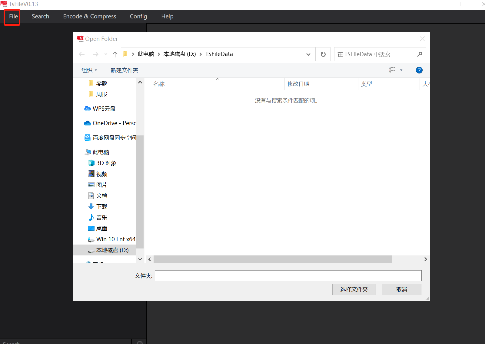
* 选择具体的某一 TsFile 右键 "open tsfile", 在弹窗中确认加载后加载此 TsFile 的数据。（下图为：非对齐时间序列数据区结构）
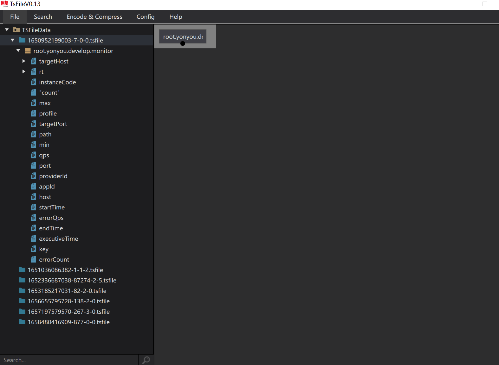
* 对齐时间序列数据区结构（根据对齐时间序列的逻辑结构进行展示）
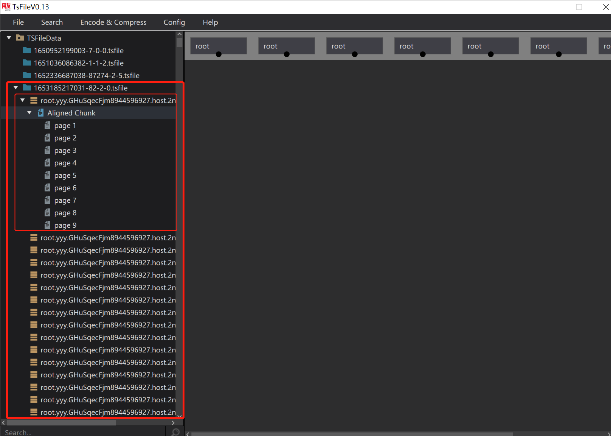
## 4.2. 查看数据区各个层级对应信息
* 在数据区的文件、Chunk、Page 层级右键会呼出相应的 Menu，点击 details 会展示相应层级的相关信息。（下图为：当前 TsFile 的详细信息）
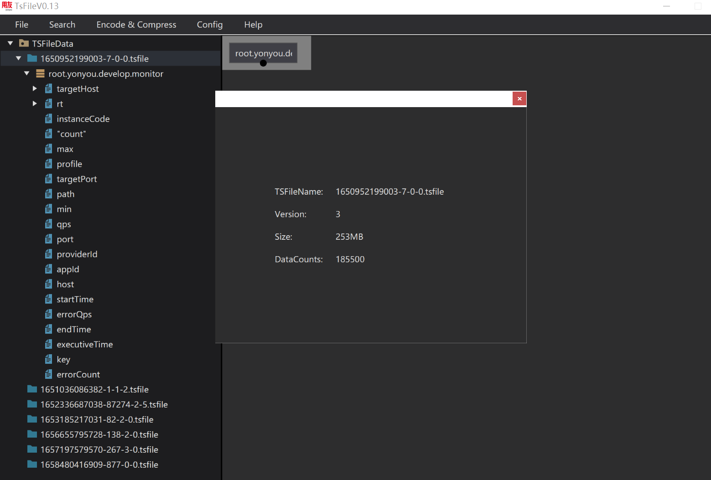
* 非对齐时间序列 Page 详细数据。（如下图非对齐时间序列的包含多页的 Chunk，展示当前 Page 的统计信息、具体的数据点集合）
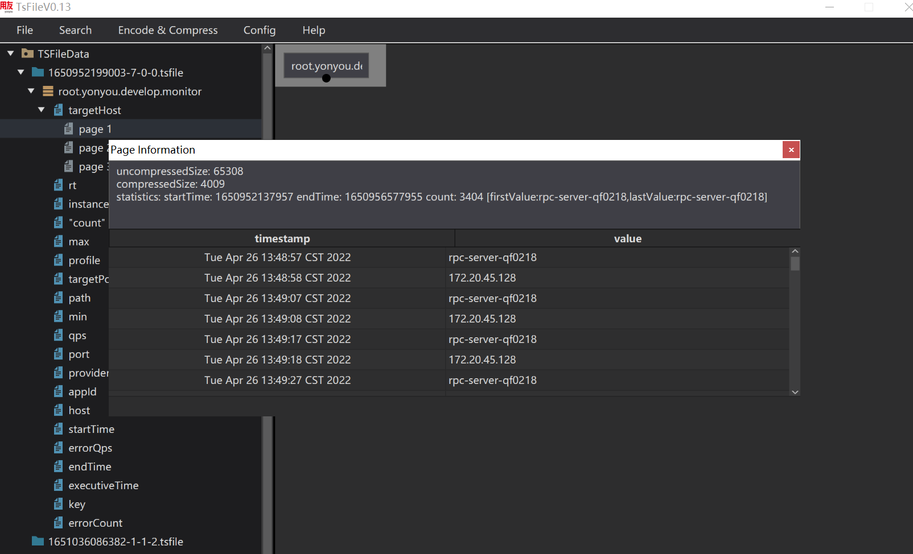
* 对齐时间序列 Page 详细数据。（将共享同一时间戳的各个物理量的数据集中起来进行展示）
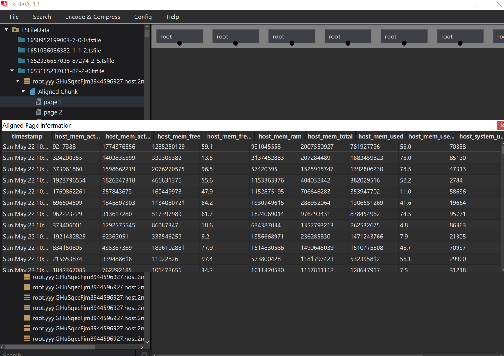
## 4.3. 查看索引区
以类似 B+ 树的数据结构展示，可以查看二级索引的整体结构（分为四层：INTERNAL_DEVICE、LEAF_DEVICE、INTERNAL_MEASUREMENT、LEAF_MEASUREMENT）。
* 点击某一层级的某个节点会联动到已加载的数据区的相应层级上。
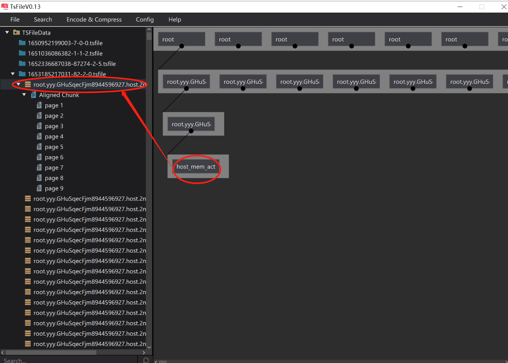
* 右键索引区某一节点并点击 "details"，会展示其相关信息。
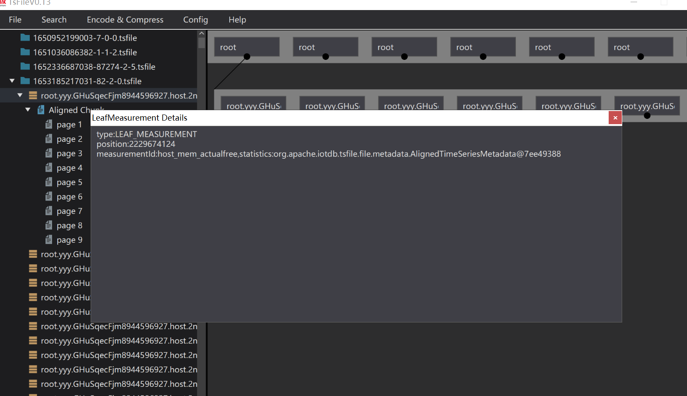
## 4.4. 搜索功能
* 时间序列搜索功能。（绑定了如：CTRL + F, ESC, ENTER 等快捷键）
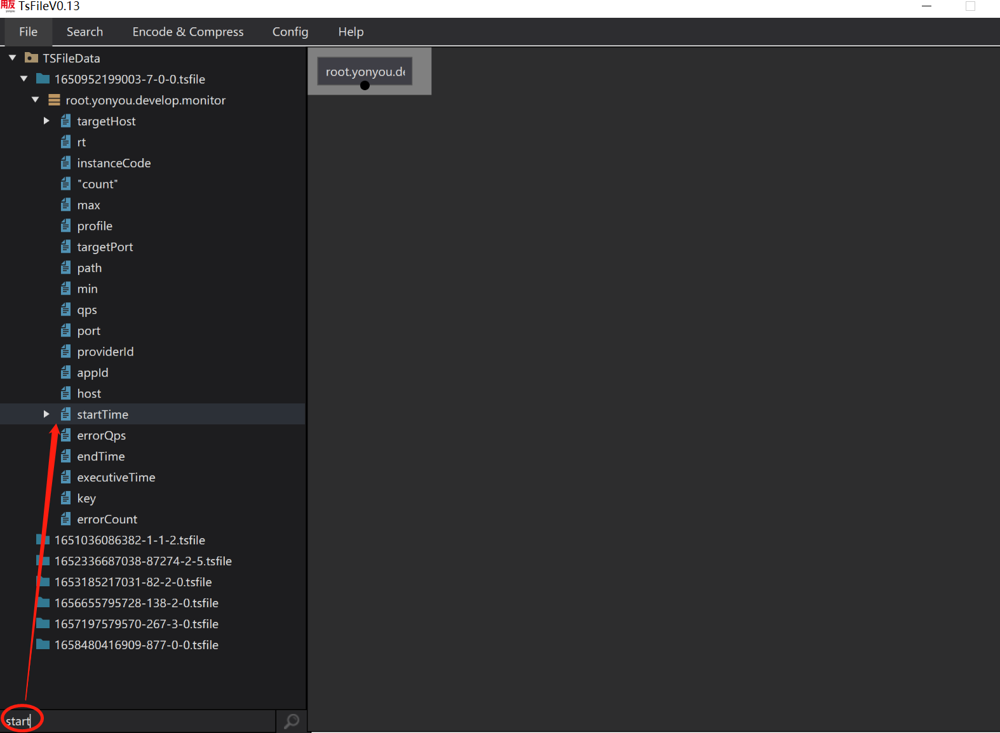
* 物理量数据搜索功能。
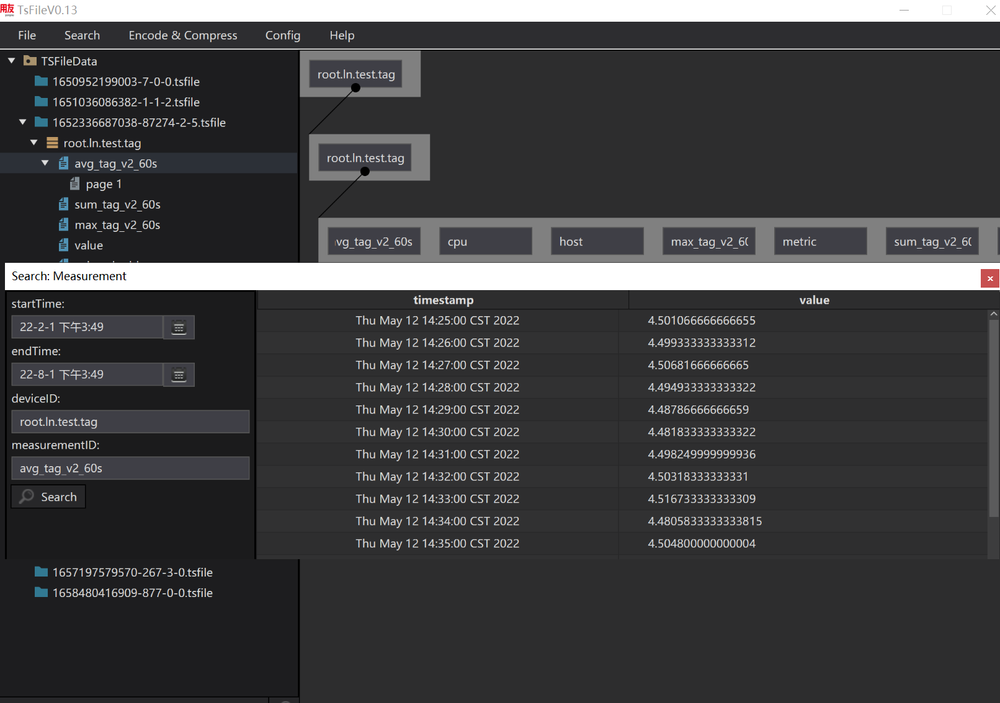
## 4.5. 编码类型与压缩类型分析
* 提供该时间序列当前编码类型与压缩类型、以及当前时间序列的数据类型所支持的各个编码类型与 IoTDB 支持的各个压缩类型的组合的编码类型与压缩类型的分析结果。
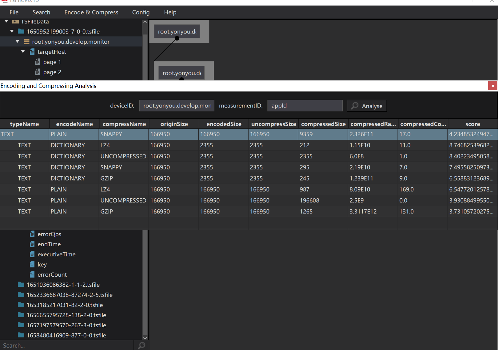