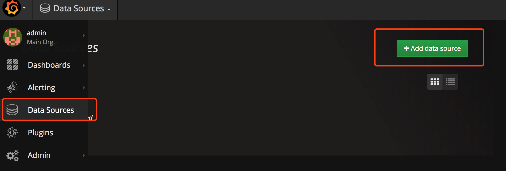
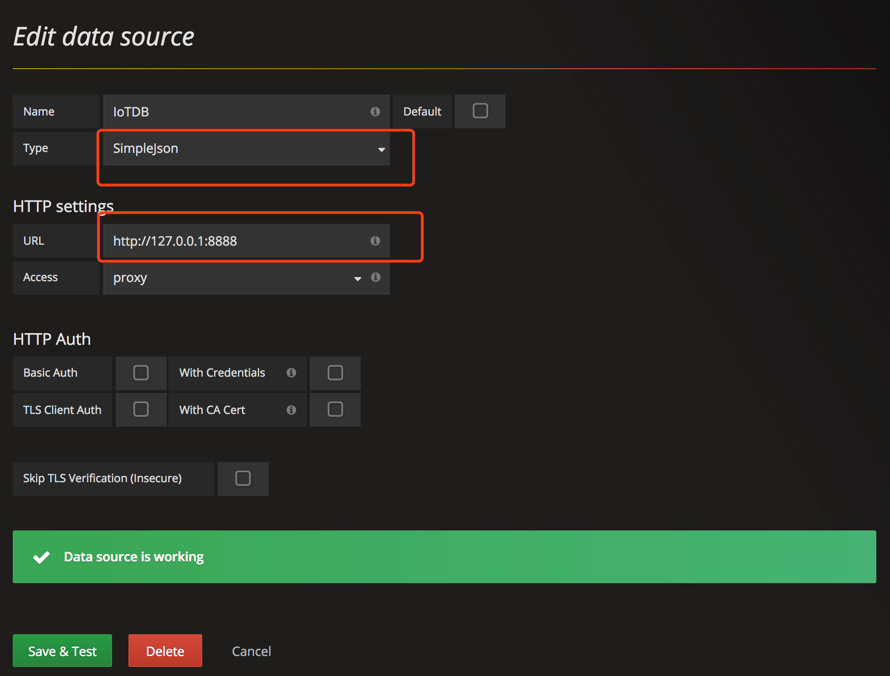
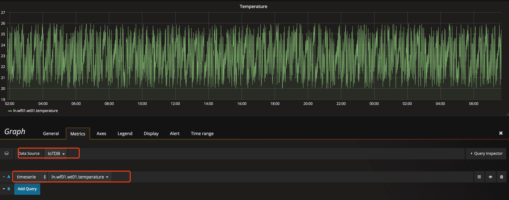

# IoTDB-Grafana

* [中文](https://github.com/thulab/iotdb/blob/master/grafana/readme_zh.md)

This project provides a connector which reads data from iotdb and sends to grafana(https://grafana.com/). Before you use this tool, make sure grafana and iotdb are correctly installed and started.

## Grafana installation

Download url: https://grafana.com/grafana/download
version >= 4.4.1

### Install data source plugin
plugin name: simple-json-datasource
Download url: https://github.com/grafana/simple-json-datasource

After downloading this plugin, you can use the grafana-cli tool to install SimpleJson from the commandline:
> grafana-cli plugins install grafana-simple-json-datasource

Alternatively, you can manually download the .zip file and unpack it into your grafana plugins directory.

* `{grafana-install-directory}/data/plugin/`（Windows）
* `/var/lib/grafana/plugins` (Linux)

### Start Grafana
Grafana will auto start after installing, or you can run `sudo service grafana-server start`

## IoTDB installation

See https://github.com/thulab/iotdb

## IoTDB-Grafana installation

```shell
git clone https://github.com/thulab/iotdb.git
mvn clean package -pl grafana -am -Dmaven.test.skip=true
cd grafana
```

Copy `application.properties` from `conf/` directory to `target` directory.(Or just make sure that `application.properties` and `iotdb-grafana-{version}-SNAPSHOT.war` are in the same directory.)

Edit `application.properties`
```
# ip and port of IoTDB 
spring.datasource.url = jdbc:tsfile://127.0.0.1:6667/
spring.datasource.username = root
spring.datasource.password = root
spring.datasource.driver-class-name=cn.edu.tsinghua.iotdb.jdbc.TsfileDriver
server.port = 8888
```

### Start IoTDB-Grafana

```shell
cd grafana/target/
java -jar iotdb-grafana-{version}-SNAPSHOT.war
```

If you see the following output, iotdb-grafana connector is successfully activated.

```shell
$ java -jar iotdb-grafana-{version}-SNAPSHOT.war

  .   ____          _            __ _ _
 /\\ / ___'_ __ _ _(_)_ __  __ _ \ \ \ \
( ( )\___ | '_ | '_| | '_ \/ _` | \ \ \ \
 \\/  ___)| |_)| | | | | || (_| |  ) ) ) )
  '  |____| .__|_| |_|_| |_\__, | / / / /
 =========|_|==============|___/=/_/_/_/
 :: Spring Boot ::        (v1.5.4.RELEASE)
...
```

## Explore in Grafana

The default port of Grafana is 3000, see http://localhost:3000

Username and password are both "admin".

### Add data source

Select `Data Sources` and  then `Add data source`, select `SimpleJson` in `Type` and `URL` is http://localhost:8888



### Design in dashboard

Add diagrams in dashboard and customize your query. See http://docs.grafana.org/guides/getting_started/




