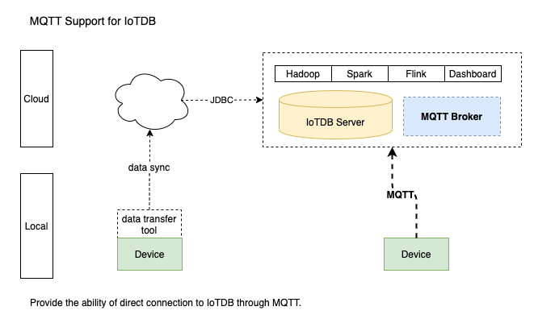
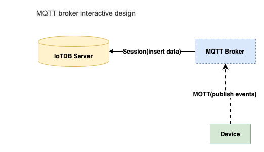

<!--

    Licensed to the Apache Software Foundation (ASF) under one
    or more contributor license agreements.  See the NOTICE file
    distributed with this work for additional information
    regarding copyright ownership.  The ASF licenses this file
    to you under the Apache License, Version 2.0 (the
    "License"); you may not use this file except in compliance
    with the License.  You may obtain a copy of the License at

        http://www.apache.org/licenses/LICENSE-2.0

    Unless required by applicable law or agreed to in writing,
    software distributed under the License is distributed on an
    "AS IS" BASIS, WITHOUT WARRANTIES OR CONDITIONS OF ANY
    KIND, either express or implied.  See the License for the
    specific language governing permissions and limitations
    under the License.

-->
# MQTT Protocol

[MQTT](http://mqtt.org/) is a machine-to-machine (M2M)/"Internet of Things" connectivity protocol.
It was designed as an extremely lightweight publish/subscribe messaging transport.
It is useful for connections with remote locations where a small code footprint is required and/or network bandwidth is at a premium.

The MQTT v3.1(an OASIS Standard) protocol support for IoTDB. This module includes the MQTT broker that allows remote devices send messages into IoTDB server directly.




## MQTT Broker
The MQTT Broker provide the ability of direct connection to IoTDB through MQTT. It listen the publish messages from MQTT clients and then
write the data into local or remote IoTDB server immediately. 
The messages payload can be format to events by `PayloadFormatter` which loaded by java SPI, and the default implementation is `JSONPayloadFormatter`.
The configuration of the broker locate `${IOTDB_HOME}/${IOTDB_CONF}/iotdb-mqtt-broker.properties`, and the startup scripts locate`${IOTDB_HOME}/sbin/start-mqtt-broker.sh (.bat for windows platform)`



## MQTT Broker Configuration
The MQTT Broker load configuration from local IoTDB server `${IOTDB_HOME}/${IOTDB_CONF}/iotdb-mqtt-broker.properties` by default.
If the local config file not exists, then load from classpath `/iotdb-mqtt-broker.properties`. Otherwise, load from the system defaults.

Configurations are as following:

| NAME        | DESCRIPTION           | DEFAULT  |
| ------------- |:-------------:|:------:|
| mqtt_broker_host      | the broker server address *Required* | 0.0.0.0 |
| mqtt_broker_port      | the broker port  *Required*    |   1883 |
| mqtt_broker_user | the broker username *Required*     |    root |
| mqtt_broker_password | the broker password *Required*       |    root |
| mqtt_broker_handler_pool_size | the publish handler pool size      |    1 |
| mqtt_broker_payload_formatter | the message payload formatter      |    json |
| iotdb_host      | the iotdb address *Required* | 127.0.0.1 |
| iotdb_port      | the iotdb port *Required*   |   6667 |
| iotdb_user | the iotdb username *Required*     |    root |
| iotdb_password | the iotdb password *Required*       |    root |


## Examples
The following is an example which a mqtt client send events to MQTT broker.

 ```java
        MQTT mqtt = new MQTT();
        mqtt.setHost("127.0.0.1", 1883);
        mqtt.setUserName("root");
        mqtt.setPassword("root");

        BlockingConnection connection = mqtt.blockingConnection();
        connection.connect();

        Random random = new Random();
        for (int i = 0; i < 10; i++) {
            Map<String,Object> tuple = new HashMap();
            tuple.put("device", "root.sg.d1");
            tuple.put("timestamp", System.currentTimeMillis());
            tuple.put("measurements", "s1");
            tuple.put("values", random.nextDouble());

            String payload = JSON.toJSONString(tuple);
            connection.publish("root.sg.d1.s1", payload.getBytes(), QoS.AT_LEAST_ONCE, false);

            Thread.sleep(1000);
        }

        connection.disconnect();
    }
 ```
