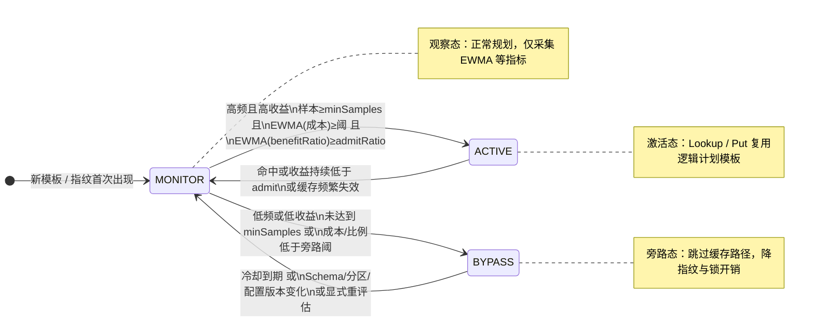

## 1. 背景与动机 （Motivation）

目前 IoTDB 表模型中，查询的生成和优化环节（如 `Logical Plan` 生成与 `Logical Optimization`）在每次查询时都会执行，存在一定的性能开销。特别是在时序场景中，存在大量“执行耗时极短，但 FE 逻辑规划耗时较长”的高频查询（典型场景：`LAST` 查询或带有 `device_id` 点查的场景）。

为降低查询解析与规划环节的开销，拟引入独立于原有 `PREPARE` 语句的智能 `Plan Cache` 机制。

目前的 `PREPARE / EXECUTE` 机制主要作用于 Session 级别，缓存复用了 AST 节点来跳过 Parser 阶段，但并未跳过后续的逻辑计划生成和逻辑优化。

针对以上情况，新的 Plan Cache 机制将直接缓存**优化后的逻辑计划模板**。采用基于“计划复用收益（即可节约的 FE 规划耗时及其占比） + 访问频率”的三态（观察/激活/旁路）状态机动态决策，以保证缓存的有效利用与内存精细化控制。

>  **绝对收益** = Logical Plan Cost（逻辑计划生成时间）+ Logical Optimization Cost（逻辑优化时间）

> **相对收益**（省下的 FE 时间在首包可返回路径中的占比（性价比）） = 节约的规划时间 / 首包响应总耗时 （First Response Latency）

## 2. 核心设计 （Core Design）

### 2.1 缓存粒度与内容

**目标**：缓存 **优化后的逻辑计划（Logical** **Query** **Plan）** 模板，跳过 `Logical Plan` 生成和 `Logical Optimization`。不对分布式计划（Distribution Plan）进行缓存，避免因 Region 状态或分片拓扑变化带来频繁的缓存失效。

缓存条目（Cache Entry）内容应包含：

1. **缓存 Key**：规范化后的 SQL 指纹（Query Fingerprint）及影响计划的上下文（如 SQL dialect，current database，Schema/Version 签名等）。
2. **缓存** **Value**：优化后的逻辑计划模板。
3. **统计信息**：
   1. 命中 / 失效次数
   2. EMA 规划耗时（Exponential Moving Average）
   3. EMA 首包响应耗时（First Response Latency）
   4. 缓存准入决策状态
   5. 最近访问时间戳

**之前版本的实现**

```Java
private String calculateCacheKey(Statement statement, Analysis analysis) {
  StringBuilder sb = new StringBuilder();
  Statement normalized = TableNameRewriter.rewrite(statement, analysis.getDatabaseName());
  sb.append(SqlFormatter.formatSql(normalized));
  long version = DataNodeTableCache.getInstance().getVersion();
  sb.append(version);
  String rawKey = sb.toString();
  String md5Key = DigestUtils.md5Hex(rawKey);
  return md5Key;
}
```

1. 替换了字面量（Literal）并补充了 Default DB 后的标准化 SQL AST 字符串。 （虽然用到了 analysis.getDatabaseName（），但本质上还是 AST 级别的信息）
2. Schema 缓存的版本号 （DataNodeTableCache.getInstance（）。getVersion（）），用于感知元数据的变更。

> Q：既然你没有使用 Analyzer 之后的内容作为 Key，那么在 Analyzer 之后进行缓存查找的意义是什么呢？

我们需要 adjustSchema，在 adjustSchema 中需要传入 analysis。

生成缓存 Key 时，对 SQL 做了字面量参数化。如 time > 100 和 time > 200，或者 device_id = 'A' 和 device_id = 'B' 的查询，会命中同一个 Logical Plan。虽然计划树的“骨架”（比如有一个 FilterNode 和一个 DeviceTableScanNode）是相同的，但底层的物理数据绑定（Schema & Partition）是完全不同的。

```TypeScript
  /** The metadataExpression in cachedValue needs to be used to update the scanNode in planNode */
  private void adjustSchema(
      DeviceTableScanNode scanNode,
      List<Expression> metaExprs,
      List<String> attributeCols,
      Map<Symbol, ColumnSchema> assignments,
      Analysis analysis) {

    long startTime = System.nanoTime();

    // 1. 根据当前查询的真实元数据表达式（代入了新的字面量），重新扫描获取匹配的设备列表
    Map<String, List<DeviceEntry>> deviceEntriesMap =
        metadata.indexScan(
            scanNode.getQualifiedObjectName(), metaExprs, attributeCols, queryContext);

    String deviceDatabase =
        !deviceEntriesMap.isEmpty() ? deviceEntriesMap.keySet().iterator().next() : null;
    List<DeviceEntry> deviceEntries =
        deviceDatabase != null ? deviceEntriesMap.get(deviceDatabase) : Collections.emptyList();
    
    // 将真实设备列表绑定到 ScanNode
    scanNode.setDeviceEntries(deviceEntries);

    // 2. 根据当前查询的真实时间表达式，重新生成底层过滤用的 TimeFilter
    Filter timeFilter =
        scanNode
            .getTimePredicate()
            .map(
                v ->
                    v.accept(
                        new ConvertPredicateToTimeFilterVisitor(
                            queryContext.getZoneId(), TimestampPrecisionUtils.currPrecision),
                        null))
            .orElse(null);
    scanNode.setTimeFilter(timeFilter);

    // 3. 根据当前的设备列表和时间过滤条件，重新向 ConfigNode （或本地缓存） 拉取数据分区信息
    DataPartition dataPartition =
        fetchDataPartitionByDevices(
            scanNode instanceof TreeDeviceViewScanNode
                ? ((TreeDeviceViewScanNode) scanNode).getTreeDBName()
                : scanNode.getQualifiedObjectName().getDatabaseName(),
            deviceEntries,
            timeFilter);
    
    // 将数据分区信息更新到 Analysis 对象中，供后续的 DistributionPlanner 使用
    analysis.upsertDataPartition(dataPartition);

    long schemaFetchCost = System.nanoTime() - startTime;
    QueryPlanCostMetricSet.getInstance().recordTablePlanCost(SCHEMA_FETCHER, schemaFetchCost);
    queryContext.setFetchSchemaCost(schemaFetchCost);

    // 4. 如果没有匹配的设备且没有聚合/Join，可以直接短路查询，表示查不到数据
    if (deviceEntries.isEmpty() && analysis.noAggregates() && !analysis.hasJoinNode()) {
      analysis.setEmptyDataSource(true);
      analysis.setFinishQueryAfterAnalyze();
    }
  }
```

### 2.2 Key 生成与模板缓存策略

查询处理流程中，**Parser****（语法解析）与 Analyzer（语义分析与元数据/权限校验）阶段无法跳过**。这是为了保证 Schema 验证和权限控制的绝对安全与实时性。

系统将自动缓存**参数化****归一化****后的查询模板（****Query** **Template）**：

在 Analyzer 解析完成之后，基于分析结果进行参数化和归一化处理（将常量替换为占位符，始终保留查询的结构、表名、列名、函数名与谓词形状），生成唯一对应的 `Plan Cache Key`（查询指纹 Fingerprint Key）。这能确保只有模式一致的高频 SQL 参数变化能映射到同一个**逻辑计划模板**进行复用，并成功跳过后续开销最大的**逻辑计划生成（Logical Plan Generation）**和**逻辑优化（Logical Optimization）**两大痛点。

### 2.3 智能准入控制 (State Machine)

智能准入控制的目标不是“让所有可缓存查询都尝试走缓存”，而是只让**复用收益稳定大于维护成本**的查询模板进入 Plan Cache。这里的判断对象不是某一条带具体字面量的 SQL，而是**参数化****归一化****后的查询模板（****Query** **Template / Fingerprint）**。

#### 2.3.1 准入范围

只有满足以下条件的查询才进入缓存候选集：

1. **纯读操作**：排除 `INSERT`、`DELETE`、`UPDATE`、DDL 等会修改数据或元数据的语句。
2. **结果确定性强**：排除包含非确定性函数或强依赖当前外部状态的语句，例如 `random()`、`now()` 等。
3. **结构相对稳定**：首版排除复杂子查询、`CTE`、`JOIN` 等高复杂度语句，后续若验证收益明确且复用边界清晰，可逐步放开。
4. **语义可安全重绑定**：命中缓存后，只允许重绑定字面量、设备列表、时间过滤、分区信息等在设计中已明确可重算的部分；若某类语句依赖不可安全复用的分析结果，则不进入缓存候选集。

#### 2.3.2 核心判断原则

Plan Cache 关心的是：**这类查询在首包返回之前是否花了过多的** **FE** **规划时间。**

因此准入控制重点比较以下两个量：

- **可复用** **FE** **成本（Reusable Planning Cost）**：`Logical Plan Cost + Logical Optimization Cost`
- **首包响应耗时（First Response Latency）**：从进入 Coordinator 到首批结果可返回给客户端的耗时

进一步可定义：

- **相对收益**：`benefitRatio = reusablePlanningCost / firstResponseLatency`
- **绝对收益**：`benefitAbs = reusablePlanningCost`

其中 `benefitRatio` 用于识别“FE 是否在首包路径上占了足够大的比例”，`benefitAbs` 用于防止极短查询因为比例看起来高、但绝对节省过小而误入缓存。

#### 2.3.3 生命周期状态

每个查询模板维护一个独立的准入状态：

1. **MONITOR（观察态）**：默认初始状态。系统只做观测和统计，不急于让模板正式进入缓存复用路径。查询仍按正常流程完成规划与优化，并记录访问频率、`reusablePlanningCost`、`firstResponseLatency` 等指标。
2. **ACTIVE（激活态）**：当某模板被判定为“高频且高收益”后进入 ACTIVE。此状态下后续同模板查询会执行 Cache Lookup；命中则直接复用缓存的逻辑计划模板，未命中则按正常路径生成并写回缓存。
3. **BYPASS（旁路态）**：当某模板被判定为“低频或低收益”后进入 BYPASS。此状态下后续查询直接绕过 Plan Cache 路径，不再进行 Lookup 和写入，避免持续支付 fingerprint 生成、查表、LRU 维护和锁竞争等开销。BYPASS 不是永久封禁；当冷却时间到期，或底层语义环境明显变化时，应重新进入 MONITOR 进行评估。

下图概括模板从入场到分流、再回退评估的闭环（对应 2.3.4–2.3.6 的转换条件）：




#### 2.3.4 状态机行为建议

建议按“先观测，再分流”的原则运行：

1. 新出现的模板一律进入 `MONITOR`
2. `MONITOR` 阶段只采集样本，不立即依赖缓存命中结果做判断
3. 样本数达到最小观察次数后，根据频率、相对收益和绝对收益决定进入 `ACTIVE` 或 `BYPASS`
4. 进入 `BYPASS` 后经过冷却期，或在 Schema / Partition / 关键配置版本变化后，回退到 `MONITOR`
5. 对 `ACTIVE` 模板也应允许在长期收益下降时降级，避免缓存被历史热点长期污染

#### 2.3.5 建议采样字段

每个模板建议维护以下统计信息：

- `sampleCount`
- `hitCount / missCount / bypassCount`
- `lastAccessTime`
- `lastStateChangeTime`
- `EWMA(reusablePlanningCost)`
- `EWMA(firstResponseLatency)`
- `EWMA(benefitRatio)`
- `cooldownDeadline`

推荐使用 **EWMA（指数滑动平均）** 而不是简单平均，以便更快反映热点变化，避免早期样本长期污染当前判断。

#### 2.3.6 状态转换建议

- **MONITOR -> ACTIVE**
  - 观察窗口内同模板请求次数 `>= minSamples`
  - `EWMA(reusablePlanningCost) >= minReusablePlanningCost`
  - `EWMA(benefitRatio) >= admitRatio`
- **MONITOR -> BYPASS**
  - 观察窗口内请求次数长期过低，达不到 `minSamples`
  - 或 `EWMA(reusablePlanningCost) < minReusablePlanningCost`
  - 或 `EWMA(benefitRatio) < bypassRatio`
- **BYPASS -> MONITOR**
  - 冷却时间到期
  - 或 Schema / Partition / 关键 Session / System 配置版本发生变化
  - 或系统收到显式清理/重评估命令
- **ACTIVE -> MONITOR**
  - 长期命中率下降
  - 或长期收益下降到 admit 阈值以下
  - 或缓存条目被频繁失效/淘汰，说明模板稳定性不足

为避免在阈值附近反复震荡，建议 `admitRatio` 与 `bypassRatio` 留出明显间隔，例如：

- `admitRatio = 20%`
- `bypassRatio = 10%`

即高于 20% 才激活，低于 10% 才旁路，处于中间区间则继续观察。

#### 2.3.7 首版建议阈值

以下阈值仅作为首版建议，最终应通过压测和灰度数据校准：

- `minSamples = 5`
- `minReusablePlanningCost = 1 ms`
- `admitRatio = 20%`
- `bypassRatio = 10%`
- `bypassCooldown = 10 min ~ 1 h`

#### 2.3.8 实现时机建议

1. **模板识别时机**：应在 `Analyzer` 完成后生成模板指纹，因为此时默认库、对象名归一化和安全校验已完成，模板形态稳定。
2. **样本更新时机**：应在拿到本次查询的 `firstResponseLatency` 后更新，而不是在 planning 刚结束时更新；否则比例会虚高。
3. **命中决策时机**：应在进入 `TableLogicalPlanner` 的缓存分支前，以 `O(1)` 代价读取模板状态：
   1. `ACTIVE`：允许 Lookup / Put
   2. `MONITOR`：走常规规划，仅采样
   3. `BYPASS`：直接跳过缓存路径

#### 2.3.9 为什么需要 BYPASS

若没有 BYPASS，系统会对所有模板长期执行“生成指纹 -> 查缓存 -> 未命中 -> 常规规划 -> 更新统计”的流程。对于大量低频、低收益查询，这条链路本身就是额外负担。BYPASS 的价值在于：

- 避免低价值查询污染缓存
- 避免热路径上无意义的 Lookup 开销
- 降低 LRU 淘汰压力
- 降低高基数模板场景下的内存和锁竞争风险

因此，智能准入控制的最终目标不是“尽可能多命中缓存”，而是：**让真正值得缓存的模板进入缓存，让不值得缓存的模板尽早退出缓存路径。**

## 3. 可观测性与关键指标 （Metrics & Observability）

Plan Cache 需要结合现有的 `QueryPlanStatistics` 进行度量和输出。**准入判断不使用** Coordinator 在多次 RPC 上累加得到的 `totalExecutionTime`，而是使用以下更贴近“首包前 FE 规划是否过重”的指标：

- **FE** **可复用规划成本 （Reusable Planning Cost）**: `Logical Plan Cost` + `Logical Optimization Cost`
- **首包响应耗时 （First Response Latency）**: **这是一个需要新增辅助打点的指标。**它表示从查询进入 Coordinator 到首批结果可返回给客户端的耗时，是 Plan Cache 准入的主指标。由于使用总耗时会把后续多次 `fetchResultsV2` 的网络传输、批量拉取和客户端消费节奏混入执行时间，导致原本在引擎里极快、但结果集较大的 SQL 被误判为“低收益”降入 BYPASS。因此必须在引擎侧新增首包耗时，用以识别“重规划、轻执行”的语句。
- **首次** **RPC** **耗时 （First Execute RPC Cost，** **Fallback****）**: 若短期内无法直接打出 `First Response Latency`，可先使用首次 `executeQueryStatementV2` 的服务端耗时作为近似代理。它仍然显著优于 `totalExecutionTime`，因为不会混入后续多轮 `fetchResultsV2` 的累计开销。

> 分几次 RPC 拉取是客户端的配置参数（fetchSize）和查询返回的总数据大小共同决定的

在现有的 `EXPLAIN ANALYZE` 中新增输出统计节点，包含：

- `Plan Cache Status`:  [HIT | MISS | BYPASS (Reason)]
  - BYPASS （DML）: 因为这是一条插入（INSERT），压根不支持缓存。
  - BYPASS （Low_Benefit）: 系统发现这条 SQL 复用计划所带来的时间收益太低，不值得为了节约 1 毫秒去挤占内存，被智能状态机主动降级了。
- `Plan Cache Lookup Cost`
  - 查找耗时：将 AST 遍历、把常量换成占位符、进行哈希计算生成“指纹”，然后再去一个大 Hash Map 里捞对象
- `Saved Logical Planning Cost`
  - 因为命中缓存，总共为你节省了多少规划时间

```Java
long startTime = System.nanoTime();
// 1. 遍历 AST，把常量替换成占位符
// 2. 将归一化后的 AST 计算成指纹 Hash
// 3. 去 ConcurrentHashMap 里 get（fingerprint）
LogicalQueryPlan plan = planCacheManager.lookupAndGet(analysisResult); 

long lookupCost = System.nanoTime() - startTime;

// 然后直接把这个 lookupCost 塞给统计上下文
queryContext.getQueryStatistics().setPlanCacheLookupCost(lookupCost);
```

### 执行耗时：`QueryExecution` 与**多次** **RPC**累加

一条查询在服务端会对应一个 `queryId` 和一份 `QueryExecution`。

同一 `queryId` 对应唯一 `QueryExecution`；一次查询**可能**经历多轮 RPC，**每轮**在 `ClientRPCServiceImpl` 侧按下方模式把本轮服务端耗时记入同一 `queryId`，最终在 `QueryExecution` 里对 `totalExecutionTime` 做多次 `+=`。完结时可用 `getTotalExecutionTime(queryId)` 取累加总量，但**该值仅适合做整体执行画像，不应用作 Plan Cache 准入主指标**。

#### 「多轮 RPC」具体指什么（CLI 与其它客户端一致）

- **第一轮**：`executeQueryStatementV2`（或同类 execute）：计划、启动执行，并在响应里尽量带上**第一批**结果，响应中带 `moreData` 等。
- **后续轮**：客户端遍历结果集时，若本地缓冲读完且服务端仍表示有更多数据，会再发 **`fetchResultsV2`**（见客户端 `IoTDBRpcDataSet`：`next()` 在需要时调用 `fetchResults()` → `fetchResultsV2`）。

**CLI** **里一条** **SQL** **会不会多轮？** 与「是不是 CLI」**无关**——CLI 底层同样是 Session/JDBC 这套 Thrift 协议。若结果很小、首批即可装下且 **`moreData == false`**（不少 `LAST` 单行场景），往往**只有 execute 这一轮**即可完成拉数；若结果超过 `fetchSize`/首批缓冲，则为 **1 次 execute + 多次 fetch**。因此 `totalExecutionTime` 可能是**一段或**多段 RPC 耗时之和，取决于结果量与分批拉取次数。也正因为如此，**准入更应关注“首个 execute / 首包返回”而不是“全量拉完结果”**。

```Java
// ClientRPCServiceImpl：各相关 RPC 入口的常见模式（示意）
long startTime = System.nanoTime();
try {
  // ...
} finally {
  long currentOperationCost = System.nanoTime() - startTime;
  COORDINATOR.recordExecutionTime(queryId, currentOperationCost);
}

// Coordinator → QueryExecution：按 queryId 累加
public void recordExecutionTime(long queryId, long executionTime) {
  IQueryExecution qe = getQueryExecution(queryId);
  if (qe != null) {
    qe.recordExecutionTime(executionTime); // totalExecutionTime += executionTime
  }
}
```

## 4. API / 用户接口设置 (Public Interfaces)

配合底层缓存能力的引入，建议添加下列控制参数开关供运维与发布时进行灵活调节。这些参数的按层级划分为**全局系统配置**与**Session 级别动态控制**两部分：

### 4.1 全局级配置 (Global Configuration)

落位于 `conf/iotdb-system.properties` 中并由 `IoTDBConfig` 及 `IoTDBDescriptor` 进行加载使用，用以约束全局系统资源的物理上限与默认启停策略：

- `smart_plan_cache_capacity = 1000` (容量上限)：系统中并发维护的 Plan Cache 条目对象个数阈值，满了可以触发 LRU 置换清理。
- `smart_plan_cache_bypass_cooldown = 1h` (跳过冷却时间)：定义一旦 SQL 被由于低收益（Low Benefit）降级到 BYPASS 状态，需要等多久其计数器归零并允许回退到 Monitor 态重新评估。
- `smart_plan_cache_mode = AUTO`：定义系统在进程启动时的默认决策状态机制。

### 4.2 会话级动态控制 (Session-level Target overriding)

支持用户在连接环境（如原生 CLI / JDBC）下，向 `SessionInfo` 系统变量挂载特定赋值，用于临时动态修改或验证自己发送请求的处理模式：

- 语法支持如 `SET smart_plan_cache_mode = OFF | MONITOR | AUTO | FORCE` 
  - `OFF`：当前 Session 关闭缓存及查询探测。
  - `MONITOR`：只探测，收集收益并落入监控与 `Saved Logical Planning Cost` 计算中，但不执行短路和模板替换逻辑。适用于评估及灰度环境采点。
  - `AUTO`：智能决策状态机的默认开启状态。
  - `FORCE`：无论收益指标大小，只要该 SQL 的基础结构合法，即强制进行匹配或生成模板替代（通常供给基准测试强制实验对比）。

### 4.3 语句级干预 (Statement-Level Hint, Optional Extension)

应对特殊客户端或特殊大报表定制需求，预留通过添加 SQL Hint 的方式去对某个显式的确不需要使用或不能复用计划的特定查询予以绕过（Bypass）：

```
SELECT /*+ NO_PLAN_CACHE */ temperature FROM root.sg.d1;
```

## 5. 缓存失效与安全边界 (Invalidation)

下述情形会导致缓存主动失效或不应进入缓存：

1. Schema / 表结构产生变更。
2. 影响 Optimizer 行为优化的用户 Session / System 配置发生变更（如开启/关闭特定优化规则）。
3. 权限语意变动。
4. 查询包含 DDL，CTE、复杂的子查询或 Join、非确定性函数（如 Random() 和强依赖当时执行时间的获取）。
5. 正常 LRU 控制触发页面置换。

## 6. 代码实现计划 (TODO)

1. **接入点****构建**：在表模型的查询入口附近引入 `PlanCacheManager`，如在 `TableModelPlanner.doLogicalPlan()` 或对应的 `QueryExecution` 流程生成 LogicalPlan 阶段切入。
2. **缓存查找机制**：在 Analyzer 出栈后获取 Analyze 结果对表征该次 Query 结构的属性进行指纹提取 (Fingerprint Lookup)。
3. **计划命中短路**：当匹配到 Cache 且有效时，将其还原拷贝或绑定当前的参数列表生成 `LogicalQueryPlan`，直接略过接下来的 `TableLogicalPlanner.planStatement` 及 Optimizer 优化链处理过程。
4. **统计与状态流转**：MPPQueryContext 中按需更新当前命中信息并在查询结束时向 `QueryPlanStatistics` 及 `PlanCacheManager` 提供最新的时长和状态量变动指标。
5. **系统变量引入与** **UT****/IT 覆盖**：完成相应开关、超时等变量的配套建设。

## 7. 测试方案 (TODO)

- **功能验证**：Cache 命中状态下的查询结果集，与从头生成的未命中态必须绝对一致。
- **失效边界保证**：验证 Schema 更新后之前的 Cache 条目能合法驱逐，不再介入错误重用。
- **性能与状态流转**：典型的高频语句（ `LAST`/ `device_id=?` ）在预期监控周期结束后，FE 的执行耗时和总耗时（First Response 时段内）发生锐减；且通过 `EXPLAIN ANALYZE` 能观察到其状态转至 `ACTIVE` 并反馈正确的 Saved Cost。长耗时、且每次特征零散分散重用率低的查询，需确保其平顺滑入 `BYPASS` 避免 OOM 污染。

## 8. 参考文献

- OceanBase Fast Parameterization / Plan Cache: https://en.oceanbase.com/docs/common-oceanbase-database-10000000001103790
- https://www.oceanbase.com/docs/community-developer-quickstart-0000000000717683
- PostgreSQL generic vs custom plan heuristic: https://www.postgresql.org/docs/current/sql-prepare.html
- 之前提交的 PlanCache 的 PR：https://github.com/apache/iotdb/pull/16228/


## 9. 附录：代码

### Version 1

#### TableLogicalPlanner.java

- 接入了 Plan Cache 的主流程：生成模板 key、查缓存、命中后 clone plan、未命中后正常规划并决定是否写缓存。
- 现在支持 Query、Explain、ExplainAnalyze 解包后进入缓存。
- 补了主干兼容逻辑，比如 CopyTo、CTE、子查询重构器、DigestUtils / instanceVersion 的适配。


```java
public LogicalQueryPlan plan(final Analysis analysis) {
    long startTime = System.nanoTime();
    long totalStartTime = startTime;
    Statement statement = analysis.getStatement();

    String cachedKey = "";
    List<Literal> literalReference = null;
    PlanCacheManager.LookupDecision lookupDecision = null;
    boolean cacheLookupAttempted = false;
    // 这里会判断当前语句是否可以走缓存路径
    // 不适合走缓存的这里会返回 null
    Query cacheableQuery = getCacheableQuery(statement);

    if (cacheableQuery != null) {
      List<Literal> literalList = generalizeStatement(cacheableQuery);
      cachedKey = calculateCacheKey(cacheableQuery, analysis);
      // 系统根据当前的缓存策略决定是否要去查缓存（shouldLookup）。如果查到了 cachedValue，说明缓存命中（Cache HIT）
      lookupDecision = PlanCacheManager.getInstance().getLookupDecision(cachedKey);
      queryContext.setPlanCacheState(lookupDecision.getState().name());
      if (lookupDecision.shouldLookup()) {
        long lookupStartTime = System.nanoTime();
        cacheLookupAttempted = true;
        CachedValue cachedValue = PlanCacheManager.getInstance().getCachedValue(cachedKey);
        queryContext.setPlanCacheLookupCost(System.nanoTime() - lookupStartTime);
        if (cachedValue != null) {
          // 缓存命中
          queryContext.setPlanCacheStatus("HIT");
          queryContext.setSavedLogicalPlanningCost(
              PlanCacheManager.getInstance().getEstimatedReusablePlanningCost(cachedKey));
          PlanCacheManager.getInstance().recordCacheHit(cachedKey);
          // deal with the device stuff
          long curTime = System.nanoTime();
          // 恢复符号表状态
          symbolAllocator.fill(cachedValue.getSymbolMap());
          symbolAllocator.setNextId(cachedValue.getSymbolNextId());
          analysis.setRespDatasetHeader(cachedValue.getRespHeader());

          // Clone the PlanNode with new literals 注入新字面量并克隆计划树
          CachedValue.ClonerContext clonerContext =
              new CachedValue.ClonerContext(
                  queryContext.getQueryId(), queryContext.getLocalQueryId(), literalList);
          PlanNode newPlan = clonePlanWithNewLiterals(cachedValue.getPlanNode(), clonerContext);
          // 处理元数据与底层扫描节点
          // Clone the metadata expressions with new literals
          List<List<Expression>> newMetadataExpressionLists = new ArrayList<>();
          if (cachedValue.getMetadataExpressionLists() != null) {
            for (List<Expression> exprList : cachedValue.getMetadataExpressionLists()) {
              if (exprList != null) {
                newMetadataExpressionLists.add(cloneMetadataExpressions(exprList, literalList));
              } else {
                // occupy an empty list and maintain a one-to-one correspondence with scanNodes
                newMetadataExpressionLists.add(new ArrayList<>());
              }
            }
          }

          List<DeviceTableScanNode> scanNodes = collectDeviceTableScanNodes(newPlan);

          for (int i = 0; i < scanNodes.size(); i++) {
            DeviceTableScanNode scanNode = scanNodes.get(i);

            List<Expression> metaExprs =
                i < newMetadataExpressionLists.size()
                    ? newMetadataExpressionLists.get(i)
                    : Collections.emptyList();
            List<String> attributeCols =
                i < cachedValue.getAttributeColumnsLists().size()
                    ? cachedValue.getAttributeColumnsLists().get(i)
                    : Collections.emptyList();
            Map<Symbol, ColumnSchema> assignments =
                i < cachedValue.getAssignmentsLists().size()
                    ? cachedValue.getAssignmentsLists().get(i)
                    : Collections.emptyMap();

            adjustSchema(scanNode, metaExprs, attributeCols, assignments, analysis);
          }

          logger.info(
              "Logical plan is cached, adjustment cost time: {}", System.nanoTime() - curTime);
          logger.info("Logical plan is cached, cost time: {}", System.nanoTime() - totalStartTime);
          logger.info(
              "Logical plan is cached, fetch schema cost time: {}",
              queryContext.getFetchPartitionCost() + queryContext.getFetchSchemaCost());

          return new LogicalQueryPlan(queryContext, newPlan);
        }
        // 如果没有查到缓存，记录状态为 MISS
        queryContext.setPlanCacheStatus("MISS");
      } else {
        // 如果一开始判定不应该查缓存（或者不支持缓存的语句），记录状态为 BYPASS
        queryContext.setPlanCacheStatus("BYPASS", lookupDecision.getReason());
      }
      // Following implementation of plan should be based on the generalizedStatement


## 10. 测试验证结果

### 10.1 测试环境

- IoTDB 2.0.7-SNAPSHOT（ly/planCache2 分支）
- 单机 standalone 部署
- 表: `test.t2`（1 TAG `device_id` + 50 FIELD `s01~s50`，INT32 类型）
- 数据量: ~101,000 行（原始 1000 行 + insert_heavy_100k.sql 导入的 50 设备 × 2000 行）

### 10.2 正面用例：LAST 点查 → ACTIVE（符合预期 ✓）

**查询模板**: `SELECT last(s01), ..., last(s10) FROM t2 WHERE device_id = ?`

**测试流程**: 先执行 10 次普通 SELECT（device_id 从 'd1' 到 'd10'），再执行 EXPLAIN ANALYZE VERBOSE。

```
EXPLAIN ANALYZE VERBOSE SELECT last(s01), last(s02), last(s03), last(s04), last(s05),
  last(s06), last(s07), last(s08), last(s09), last(s10)
  FROM t2 WHERE device_id = 'd11';
```

**输出结果**:

```
Analyze Cost: 0.822 ms
Fetch Partition Cost: 0.543 ms
Fetch Schema Cost: 0.075 ms
Logical Plan Cost: 1.009 ms
Logical Optimization Cost: 4.007 ms
Distribution Plan Cost: 0.240 ms
Plan Cache Status: HIT
Plan Cache State: ACTIVE
Plan Cache Lookup Cost: 0.001 ms
Saved Logical Planning Cost: 5.017 ms
Dispatch Cost: 2.143 ms
Fragment Instances Count: 1
```

**分析**:

| 指标 | 值 | 说明 |
|---|---|---|
| Plan Cache Status | **HIT** | 缓存命中，直接复用逻辑计划模板 |
| Plan Cache State | **ACTIVE** | 模板已从 MONITOR 晋升为 ACTIVE |
| Saved Logical Planning Cost | **5.017 ms** | 节省了约 5ms 的规划时间 |
| 实际 Logical Plan + Optimization | 1.009 + 4.007 = **5.016 ms** | 与 Saved Cost 一致（这是 EXPLAIN ANALYZE 走完整规划路径的开销） |
| Fragment Instances | 1 | 单设备查询，只需 1 个分片实例 |

**结论**: 完全符合预期。LAST 点查属于"重规划、轻执行"的查询，`benefitRatio = reusablePlanningCost / firstResponseLatency` 远大于 20% 的 `admitRatio`，在 5 次采样后成功晋升 ACTIVE，后续查询直接命中缓存，每次可节省 ~5ms 的 FE 规划时间。

### 10.3 反面用例：全表聚合 → 仍在 MONITOR（暂未触发 BYPASS）

**查询模板**: `SELECT avg(s01), ..., avg(s50) FROM t2 WHERE time >= ?`

**测试流程**: 执行若干次普通 SELECT（变换 time 字面量），再执行 EXPLAIN ANALYZE VERBOSE。

```
EXPLAIN ANALYZE VERBOSE SELECT avg(s01), avg(s02), ..., avg(s50)
  FROM t2 WHERE time >= 1700000000007;
```

**输出结果**:

```
Analyze Cost: 1.462 ms
Fetch Partition Cost: 0.977 ms
Fetch Schema Cost: 2.621 ms
Logical Plan Cost: 1.549 ms
Logical Optimization Cost: 5.957 ms
Distribution Plan Cost: 0.798 ms
Plan Cache Status: BYPASS (Collecting_Samples)
Plan Cache State: MONITOR
Plan Cache Lookup Cost: 0.000 ms
Saved Logical Planning Cost: 0.000 ms
Dispatch Cost: 1.999 ms
Fragment Instances Count: 4
```

**分析**:

| 指标 | 值 | 说明 |
|---|---|---|
| Plan Cache Status | **BYPASS (Collecting_Samples)** | 模板仍在采样期，未达到 `minSamples=5` |
| Plan Cache State | **MONITOR** | 初始观察态 |
| Logical Plan + Optimization | 1.549 + 5.957 = **7.506 ms** | FE 规划耗时 |
| Fragment Instances | 4 | 全表扫描涉及 4 个数据分区 |

**问题**: 当前 1000 行数据量太少，全表聚合的执行时间（几 ms）与规划时间（~7.5ms）相当，`benefitRatio` 仍然较高，即使采样完成也会晋升 ACTIVE 而非 BYPASS。要触发 BYPASS 需要：

1. **增加数据量到 10 万+行**（已准备 `insert_heavy_100k.sql`，50 设备 × 2000 行 = 100K 行），使执行时间涨到几百 ms 级别
2. 此时 `benefitRatio = ~7.5ms / ~200ms ≈ 3.75%` < `bypassRatio(10%)`，应成功降级为 BYPASS

### 10.4 Bug 修复验证：EXPLAIN ANALYZE + Cache HIT

在测试过程中发现一个 Bug：当查询模板处于 ACTIVE 状态时，`EXPLAIN ANALYZE SELECT ...` 返回的是**原始查询结果**而非分析报告。

**根因**: `getCacheableQuery()` 将 `EXPLAIN ANALYZE SELECT ...` 和 `SELECT ...` 解包为相同的 `Query`，产生相同的 cache key。Cache HIT 路径直接返回了数据查询计划（没有 `ExplainAnalyzeNode` 包装）。

**修复**: 在 cache HIT 判断条件中加入 `!queryContext.isExplainAnalyze()` 检查。EXPLAIN ANALYZE 跳过缓存早返回，走完整 `planExplainAnalyze()` 路径，但仍正确报告 `Plan Cache Status: HIT` 和 `Plan Cache State: ACTIVE`。

**修复后效果**: 上述 10.2 的输出即为修复后的结果，EXPLAIN ANALYZE 既能正确显示 HIT/ACTIVE 状态，又能输出完整的分析报告。
      literalReference = literalList;
    } else {
      queryContext.setPlanCacheStatus("BYPASS", "Unsupported_Statement");
    }

    // The logical plan was not hit. The logical plan generation stage needs to be executed
```


#### PlanCacheManager.java

这是缓存管理器。

- 提供 LRU plan cache。
- 增加模板级状态机：MONITOR / ACTIVE / BYPASS。
- 用采样指标决定一个模板什么时候值得缓存。
- 维护命中、未命中、收益估计、旁路冷却期这些状态。
- shouldCache() 不再是简单开关，而是由状态机决策。

**`TemplateProfile` 内部类及其驱动的“三态有限状态机（State Machine）”与“基于 EWMA 的代价评估机制”**。

普通的缓存逻辑是“遇到新的就存，满了就踢”。但在这里，系统会先**“观察”**。因为它认识到一个关键问题：**并不是所有的 SQL 都值得被缓存**。如果一个 SQL 生成计划极快，但执行极慢，把它的计划缓存起来不但省不了多少时间，反而浪费宝贵的缓存内存空间，甚至增加查找缓存的开销。

`TemplateProfile` 解决了这个问题，它让缓存具备了“只缓存高价值目标”的能力。

**1. 智能三态模型 (PlanCacheState)**

系统将每一个 SQL 模板（泛化后的结构）分为三种状态，并在运行中动态切换：

- **MONITOR (观察期)**：新的 SQL 模板刚到来时的状态。系统不会立即查缓存，而是去真实生成计划并执行，收集前几次（`MIN_SAMPLES = 5`）的耗时数据。
- **ACTIVE (活跃期)**：经过观察，如果系统发现这个 SQL 模板**生成计划很费时**且**缓存性价比高**，就会将其升级为 ACTIVE。处于这个状态的查询才真正享受缓存加速。
- **BYPASS (绕过/冷宫期)**：如果观察发现缓存这个模板“收益太低”（比如规划时间小于 1 毫秒，或者执行耗时远大于规划耗时），它会被打入冷宫。系统会直接拒绝它的缓存查找（返回 `BYPASS`），避免浪费资源。为了防止环境变化，它有一个“冷却期”（10分钟），冷却期到了会重新变回 `MONITOR` 再次评估。

**2. 指数加权移动平均 (EWMA) 的代价评估**

在 `TemplateProfile.recordExecution` 方法中，代码使用了经典的 EWMA 算法来平滑统计代价，公式为：

$Current = Current \times (1 - \alpha) + Latest \times \alpha$ （代码中 $\alpha = 0.5$）。

这用于计算三个关键指标：

- `ewmaReusablePlanningCost`：可以被节省下来的生成计划耗时。
- `ewmaFirstResponseLatency`：首次响应延迟（执行耗时）。
- `ewmaBenefitRatio`：收益率（节省的时间占总时间的比例）。

**晋升 ACTIVE 的条件**：必须同时满足“省下的时间足够多”（$\ge 1ms$）且“省下的时间占总查询时间的比例足够大”（$\ge 20\%$ `ADMIT_RATIO`）。

**降级 BYPASS 的条件**：收益比例低于 10% (`BYPASS_RATIO`) 或者节省的绝对时间太少。

> 因为直接从缓存里拿到了现成的“逻辑查询计划”，系统**并没有真正去执行**生成计划的代码。既然没有执行，系统就不知道“如果不走缓存，这次到底会花多少时间”。为了在监控指标中体现出“缓存机制为这次查询节省了多少时间”，系统必须去拿一个**历史估算值**。这个值就是 `ewmaReusablePlanningCost`。

> **为什么要用 EWMA 而不是简单平均数？** 因为数据库系统的负载是动态的。最近一次的耗时（权重占 50%）比很久以前的耗时更能反映当前系统的真实负载情况。

**3. 严格的双重内存限制与 LRU 淘汰 (`cacheValue` 方法)**

当计划被允许缓存时，它存入 `planCache`（一个初始化了 `accessOrder = true` 的 `LinkedHashMap`，即天然的 LRU 淘汰队列）。

它不仅限制缓存的条目数量（`MAX_CACHE_SIZE = 1000`），还使用 `RamUsageEstimator` 精确追踪内存字节大小，限制最大内存占用（`MAX_MEMORY_BYTES = 64MB`）。当两者之一超标时，会不断剔除最久未使用的项，防止出现 OOM（内存溢出）。

**4. 高效的并发控制**

- **缓存结构**：存储 `Profile` 的 `templateProfiles` 用的是高并发的 `ConcurrentHashMap`，因为状态指标会极其频繁地被各个查询线程更新。
- **锁粒度分离**：具体的统计逻辑（`recordExecution` 等）在 `TemplateProfile` 实例级别加 `synchronized`，锁粒度极小（只锁当前模板），不影响其他 SQL 模板。而真正的缓存写入和淘汰操作则对 `planCache` 加全局锁，保证 LRU 链表和内存计数的绝对安全。

**总结工作流**

当一条 SQL 进来时，它的交互流程是这样的：

1. **查状态 (`getLookupDecision`)**：询问 `PlanCacheManager` 当前这个 SQL 模板是什么状态？如果是 `ACTIVE`，就去拉取缓存；如果是 `BYPASS` 或 `MONITOR`，则正常走老路生成计划。
2. **执行并记录反馈 (`recordExecution`)**：不管走没走缓存，查询执行完后，都要把“计划生成花了多长时间”、“执行花了多长时间”汇报给 Manager。
3. **状态流转**：Manager 根据汇报的指标，用 EWMA 算法算一下，动态决定这个 SQL 模板接下来是晋升、降级还是继续保持。
4. **安全入库 (`cacheValue`)**：如果是值得缓存的，将其存入限制了 64MB 和 1000 条的 LRU 安全队列中。


```java
private static class TemplateProfile {
    private static final double EWMA_ALPHA = 0.5;

    private PlanCacheState state = PlanCacheState.MONITOR;
    private long sampleCount;
    private long hitCount;
    private long missCount;
    private long bypassCount;
    private long lastAccessTime;
    private long lastStateChangeTime;
    private long cooldownDeadline;
    private double ewmaReusablePlanningCost;
    private double ewmaFirstResponseLatency;
    private double ewmaBenefitRatio;

    synchronized LookupDecision beforeLookup(long now, long bypassCooldownNanos) {
      // 如果当前是 BYPASS，但发现当前时间 now 已经超过了 cooldownDeadline（冷却期，结合上文是 10 分钟），系统会把它改回 MONITOR
      if (state == PlanCacheState.BYPASS && now >= cooldownDeadline) {
        state = PlanCacheState.MONITOR;
        lastStateChangeTime = now;
      }
      lastAccessTime = now;
      // 如果是 ACTIVE，返回 shouldLookup = true（去查吧）
      if (state == PlanCacheState.ACTIVE) {
        return new LookupDecision(state, true, "");
      }
      // 如果是 BYPASS，拦截并返回原因 "Low_Benefit"
      if (state == PlanCacheState.BYPASS) {
        bypassCount++;
        return new LookupDecision(state, false, "Low_Benefit");
      }
      // 如果是 MONITOR，拦截并返回原因 "Collecting_Samples"（还在收集样本中）
      return new LookupDecision(state, false, "Collecting_Samples");
    }

    synchronized PlanCacheState recordExecution(
        // 先把传进来的 reusablePlanningCost（计划耗时）和 firstResponseLatency（执行耗时）通过 EWMA 公式揉进历史均值里。计算出这次的收益率并更新 ewmaBenefitRatio
        long reusablePlanningCost,
        long firstResponseLatency,
        boolean cacheLookupMiss,
        int minSamples,
        long minReusablePlanningCost,
        double admitRatio,
        double bypassRatio,
        long bypassCooldownNanos,
        long now) {
      lastAccessTime = now;
      sampleCount++;
      if (cacheLookupMiss) {
        missCount++;
      }

      ewmaReusablePlanningCost = ewma(ewmaReusablePlanningCost, reusablePlanningCost);
      ewmaFirstResponseLatency = ewma(ewmaFirstResponseLatency, firstResponseLatency);
      double benefitRatio =
          firstResponseLatency <= 0 ? 0 : ((double) reusablePlanningCost) / firstResponseLatency;
      ewmaBenefitRatio = ewma(ewmaBenefitRatio, benefitRatio);

      // 必须处于 MONITOR 状态，且采样次数 sampleCount >= minSamples（样本数够了，默认 5 次）
      if (state == PlanCacheState.MONITOR && sampleCount >= minSamples) {
        // 晋升条件：如果“平均节省耗时”大于阈值（默认 1ms） 且 “收益率”大于 admitRatio（默认 20%），晋升为 ACTIVE。
        if (ewmaReusablePlanningCost >= minReusablePlanningCost && ewmaBenefitRatio >= admitRatio) {
          state = PlanCacheState.ACTIVE;
          lastStateChangeTime = now;
        // 降级条件：如果“平均节省耗时”太短 或 “收益率”低于 bypassRatio（默认 10%），降级为 BYPASS，并设置长达 10 分钟的 cooldownDeadline。
        } else if (ewmaReusablePlanningCost < minReusablePlanningCost
            || ewmaBenefitRatio < bypassRatio) {
          state = PlanCacheState.BYPASS;
          cooldownDeadline = now + bypassCooldownNanos;
          lastStateChangeTime = now;
        }
      }
      return state;
    }

    synchronized void recordCacheHit(long now) {
      hitCount++;
      lastAccessTime = now;
    }

    synchronized PlanCacheState getState() {
      return state;
    }

    synchronized long getEstimatedReusablePlanningCost() {
      return (long) ewmaReusablePlanningCost;
    }

    private double ewma(double current, double latest) {
      if (current == 0) {
        return latest;
      }
      return current * (1 - EWMA_ALPHA) + latest * EWMA_ALPHA;
    }
  }
```

